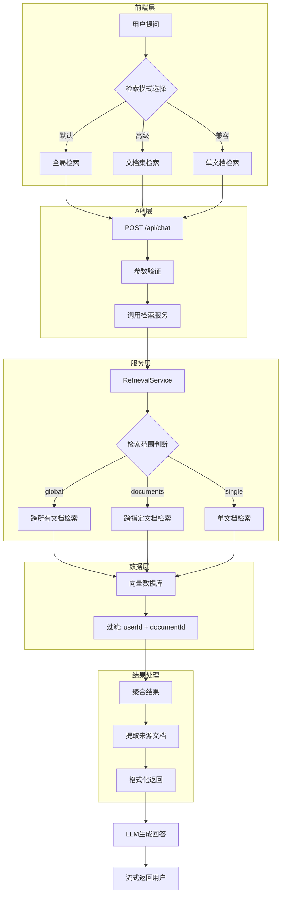

# 跨文档检索架构设计文档

## 文档信息

| 项目 | 内容 |
|------|------|
| **文档标题** | 跨文档检索功能架构设计 |
| **创建日期** | 2025-01-15 |
| **架构师** | Winston (Architect Agent) |
| **状态** | 设计完成，待实施 |
| **优先级** | P0 - 核心用户体验改进 |
| **Epic** | Epic 4.13 - 跨文档智能检索 |

---

## 📋 目录

- [1. 背景与问题](#1-背景与问题)
- [2. 设计目标](#2-设计目标)
- [3. 架构设计](#3-架构设计)
- [4. 接口定义](#4-接口定义)
- [5. 数据结构](#5-数据结构)
- [6. 实施计划](#6-实施计划)
- [7. 测试策略](#7-测试策略)
- [8. 风险与缓解](#8-风险与缓解)
- [9. 性能与优化](#9-性能与优化)
- [10. 参考资料](#10-参考资料)

---

## 1. 背景与问题

### 1.1 当前架构限制

**现状分析：**

```typescript
// 当前实现：src/services/rag/retrievalService.ts
async retrieveContext(
  query: string,
  documentId: string,  // 强制要求单个文档ID
  userId: string,
  options: RetrievalOptions = {}
): Promise<RetrievalResult>
```

**存在的问题：**

1. **用户体验差**
   - ❌ 用户必须在提问前选择一个文档
   - ❌ 无法利用已上传的所有文档进行综合问答
   - ❌ 每次切换文档需要重新选择

2. **功能受限**
   - ❌ 无法跨文档比较信息
   - ❌ 无法综合多个文档的知识
   - ❌ 不符合"知识库问答"的用户预期

3. **场景不适配**
   - ❌ 当前设计仅适合"单文档深度阅读"场景
   - ❌ 不适合"知识库综合检索"场景
   - ❌ 限制了产品的应用范围

### 1.2 用户真实需求

**典型使用场景：**

| 场景 | 用户期望 | 当前体验 |
|------|---------|---------|
| **学生学习** | 上传多门课程资料，直接提问 | ❌ 必须先选择哪本教材 |
| **研究人员** | 上传多篇论文，跨文献对比 | ❌ 只能逐个文档查询 |
| **企业用户** | 上传公司文档库，智能检索 | ❌ 需要记住信息在哪个文档 |
| **个人知识库** | 上传所有笔记，自由提问 | ❌ 无法跨笔本搜索 |

**用户期望的理想流程：**

```
用户上传文档 → 直接提问 → 系统自动从所有文档中检索相关信息 → 生成综合答案
```

---

## 2. 设计目标

### 2.1 核心目标

1. **✅ 支持全局检索** - 默认跨用户所有文档检索
2. **✅ 灵活的检索范围** - 支持全局/多文档/单文档三种模式
3. **✅ 向后兼容** - 保留原有单文档检索能力
4. **✅ 清晰的来源标注** - 结果中明确标注信息来源
5. **✅ 性能可控** - 提供范围限定机制，避免性能问题

### 2.2 非功能性目标

| 目标 | 指标 | 当前 | 目标 |
|------|------|------|------|
| **检索响应时间** | P95 | 2-3s | ≤3s |
| **首字节延迟** | TTFB | 0.5-1s | ≤1s |
| **向后兼容性** | API | - | 100% |
| **用户体验提升** | 点击次数 | 3次（选文档+提问） | 1次（直接提问） |

### 2.3 约束条件

- ✅ 必须保证用户数据隔离（权限验证）
- ✅ 不能显著增加系统负载
- ✅ 需要分阶段实施，降低风险
- ✅ 前端改动最小化

---

## 3. 架构设计

### 3.1 系统架构图



### 3.2 核心设计决策

#### 决策 1: 检索模式设计

**三种模式：**

| 模式 | 使用场景 | 过滤器 | 默认？ |
|------|---------|--------|--------|
| **global** | 日常使用，跨所有文档 | `{ userId }` | ✅ 是 |
| **documents** | 限定特定文档集 | `{ userId, documentId: { in: [...] } }` | ❌ |
| **single** | 兼容旧逻辑，单文档 | `{ userId, documentId }` | ❌ |

**设计理由：**
- ✅ 默认全局检索，符合用户预期
- ✅ 提供灵活性，支持精确控制
- ✅ 向后兼容，保留单文档模式

#### 决策 2: 过滤器动态构建

```typescript
// 动态构建过滤器，而非静态传入 documentId
private buildFilter(
  userId: string, 
  scope: RetrievalScope
): VectorFilter {
  const filter: VectorFilter = { 
    userId  // 始终保证用户隔离
  }
  
  switch (scope.mode) {
    case 'global':
      // 不添加 documentId 过滤
      break
      
    case 'documents':
      filter.documentId = { in: scope.documentIds }
      break
      
    case 'single':
      filter.documentId = scope.documentIds[0]
      break
  }
  
  return filter
}
```

**设计理由：**
- ✅ 灵活且类型安全
- ✅ 集中管理过滤逻辑
- ✅ 易于扩展（如：添加文档分类过滤）

#### 决策 3: 结果结构增强

```typescript
// 增强结果结构，包含来源信息
interface RetrievalResult {
  chunks: RetrievalChunk[]
  
  // 新增：来源文档统计
  sourceDocuments: Array<{
    documentId: string
    documentName: string
    documentType: string
    chunkCount: number      // 该文档贡献的chunk数
    topScore: number         // 该文档最高相似度
  }>
  
  // 新增：检索范围记录
  scope: RetrievalScope
  
  // 原有字段
  totalFound: number
  query: string
  cached: boolean
  retrievalTime: number
}
```

**设计理由：**
- ✅ 提供信息溯源能力
- ✅ 支持结果展示优化
- ✅ 便于后续分析和优化

---

## 4. 接口定义

### 4.1 类型定义

```typescript
/**
 * 检索范围配置
 */
export interface RetrievalScope {
  mode: 'global' | 'documents' | 'single'
  documentIds?: string[]  // documents/single 模式需要
}

/**
 * 检索选项（扩展）
 */
export interface RetrievalOptions {
  topK?: number           // 返回top-K个结果，默认5
  minScore?: number       // 最小相似度阈值，默认0.3
  useCache?: boolean      // 是否使用缓存，默认true
  
  // 新增：检索范围
  scope?: RetrievalScope  // 默认 { mode: 'global' }
}

/**
 * 来源文档信息
 */
export interface SourceDocument {
  documentId: string
  documentName: string
  documentType: string    // 'pdf' | 'docx' | 'txt' | 'md'
  chunkCount: number      // 该文档贡献的chunk数量
  topScore: number        // 该文档中最高的相似度分数
  uploadedAt: Date        // 文档上传时间
}

/**
 * 检索结果（扩展）
 */
export interface RetrievalResult {
  chunks: RetrievalChunk[]
  totalFound: number
  query: string
  cached: boolean
  retrievalTime: number
  
  // 新增字段
  sourceDocuments: SourceDocument[]  // 来源文档列表
  scope: RetrievalScope              // 使用的检索范围
}

/**
 * 向量过滤器
 */
export interface VectorFilter {
  userId: string
  documentId?: string | { in: string[] }
  // 未来扩展：
  // category?: string
  // tags?: string[]
  // dateRange?: { from: Date, to: Date }
}
```

### 4.2 服务接口

#### RetrievalService 改造

```typescript
export class RetrievalService {
  /**
   * 检索相关上下文（重构）
   * 
   * @param query 用户问题
   * @param userId 用户ID
   * @param options 检索选项（包含范围配置）
   * @returns 检索结果（包含来源信息）
   */
  async retrieveContext(
    query: string,
    userId: string,
    options: RetrievalOptions = {}
  ): Promise<RetrievalResult>
  
  /**
   * 构建动态过滤器
   * @private
   */
  private buildFilter(
    userId: string, 
    scope: RetrievalScope
  ): VectorFilter
  
  /**
   * 提取来源文档信息
   * @private
   */
  private async extractSourceDocuments(
    chunks: RetrievalChunk[]
  ): Promise<SourceDocument[]>
  
  /**
   * 验证用户对文档集的访问权限
   * @private
   */
  private async verifyDocumentsAccess(
    documentIds: string[],
    userId: string
  ): Promise<void>
}
```

### 4.3 API 端点改造

#### POST /api/chat（扩展）

**请求体：**

```typescript
interface ChatRequest {
  query: string                    // 必需：用户问题
  conversationId?: string          // 可选：对话ID
  
  // 新增：检索范围配置
  documentScope?: {
    mode: 'global' | 'documents' | 'single'
    documentIds?: string[]         // mode !== 'global' 时需要
  }
  
  // 现有字段保持不变
  temperature?: number
  maxTokens?: number
}
```

**响应示例：**

```json
{
  "success": true,
  "data": {
    "answer": "根据您的文档内容...",
    "sources": [
      {
        "documentId": "doc-123",
        "documentName": "产品需求文档.pdf",
        "documentType": "pdf",
        "chunkCount": 3,
        "topScore": 0.87
      },
      {
        "documentId": "doc-456",
        "documentName": "技术架构.docx",
        "documentType": "docx",
        "chunkCount": 2,
        "topScore": 0.82
      }
    ],
    "scope": {
      "mode": "global"
    },
    "conversationId": "conv-789",
    "retrievalTime": 450
  }
}
```

**向后兼容处理：**

```typescript
// API层兼容逻辑
const scope: RetrievalScope = 
  req.body.documentScope ?? 
  (req.body.documentId ? {
    mode: 'single',
    documentIds: [req.body.documentId]
  } : {
    mode: 'global'
  })
```

---

## 5. 数据结构

### 5.1 数据库 Schema（无需修改）

当前的 `document_chunks` 表已经支持此功能：

```sql
-- 现有表结构（无需修改）
CREATE TABLE document_chunks (
  id TEXT PRIMARY KEY,
  document_id TEXT NOT NULL,
  user_id TEXT NOT NULL,
  chunk_index INTEGER NOT NULL,
  content TEXT NOT NULL,
  embedding vector(1024),  -- pgvector 扩展
  metadata JSONB,
  
  -- 索引（现有）
  FOREIGN KEY (document_id) REFERENCES documents(id),
  FOREIGN KEY (user_id) REFERENCES users(id)
);

-- 现有索引（已支持跨文档查询）
CREATE INDEX idx_chunks_user_id ON document_chunks(user_id);
CREATE INDEX idx_chunks_document_id ON document_chunks(document_id);
CREATE INDEX idx_chunks_embedding ON document_chunks 
  USING ivfflat (embedding vector_cosine_ops);
```

**分析：**
- ✅ `user_id` 索引支持用户级过滤
- ✅ `embedding` 索引支持向量检索
- ✅ 无需额外迁移，直接使用

### 5.2 向量检索查询模式

#### 模式 1: 全局检索（新）

```sql
-- 跨用户所有文档检索
SELECT 
  c.id,
  c.document_id,
  c.content,
  c.metadata,
  d.name as document_name,
  1 - (c.embedding <=> $1::vector) as score
FROM document_chunks c
JOIN documents d ON c.document_id = d.id
WHERE c.user_id = $2
  AND (1 - (c.embedding <=> $1::vector)) > $3  -- minScore
ORDER BY c.embedding <=> $1::vector
LIMIT $4;  -- topK
```

#### 模式 2: 文档集检索（新）

```sql
-- 跨指定文档检索
SELECT ...
WHERE c.user_id = $2
  AND c.document_id = ANY($5::text[])  -- documentIds 数组
  AND (1 - (c.embedding <=> $1::vector)) > $3
ORDER BY c.embedding <=> $1::vector
LIMIT $4;
```

#### 模式 3: 单文档检索（现有）

```sql
-- 单个文档检索（兼容现有逻辑）
SELECT ...
WHERE c.user_id = $2
  AND c.document_id = $5
  AND (1 - (c.embedding <=> $1::vector)) > $3
ORDER BY c.embedding <=> $1::vector
LIMIT $4;
```

### 5.3 缓存键设计

```typescript
/**
 * 缓存键生成策略
 */
class QueryCacheService {
  private generateCacheKey(
    scope: RetrievalScope,
    query: string
  ): string {
    const queryHash = this.hashQuery(query)
    
    switch (scope.mode) {
      case 'global':
        // 全局缓存：userId + 查询hash
        return `${scope.userId}:global:${queryHash}`
        
      case 'documents':
        // 文档集缓存：userId + 有序docIds + 查询hash
        const docKey = scope.documentIds!.sort().join(',')
        return `${scope.userId}:docs:${docKey}:${queryHash}`
        
      case 'single':
        // 单文档缓存：userId + docId + 查询hash
        return `${scope.userId}:doc:${scope.documentIds![0]}:${queryHash}`
    }
  }
}
```

---

## 6. 实施计划

### 6.1 分阶段实施策略

#### Phase 1: 核心改造（1-2天）

**目标：** 支持全局检索，保持向后兼容

| 任务 | 文件 | 工作量 |
|------|------|--------|
| 1.1 定义新类型 | `src/types/rag.ts` | 1h |
| 1.2 重构 RetrievalService | `src/services/rag/retrievalService.ts` | 3h |
| 1.3 更新 API 路由 | `src/app/api/chat/route.ts` | 2h |
| 1.4 单元测试 | `tests/unit/retrievalService.test.ts` | 2h |
| 1.5 集成测试 | `tests/integration/cross-document.test.ts` | 2h |

**验收标准：**
- ✅ 支持三种检索模式
- ✅ 所有现有测试通过
- ✅ 向后兼容：传入 `documentId` 仍然工作

#### Phase 2: 前端适配（1天）

**目标：** 前端默认使用全局检索

| 任务 | 文件 | 工作量 |
|------|------|--------|
| 2.1 更新 ChatInterface | `src/components/chat/ChatInterface.tsx` | 2h |
| 2.2 移除强制文档选择 | `src/components/chat/DocumentSelector.tsx` | 1h |
| 2.3 添加来源展示组件 | `src/components/chat/SourceDocuments.tsx` | 2h |
| 2.4 更新 useChat hook | `src/hooks/useChat.ts` | 1h |
| 2.5 E2E 测试 | `tests/e2e/cross-document-chat.test.ts` | 2h |

**验收标准：**
- ✅ 用户无需选择文档即可提问
- ✅ 回答中显示来源文档
- ✅ 高级用户可选择限定范围

#### Phase 3: 优化与增强（2-3天）

**目标：** 性能优化和用户体验提升

| 任务 | 描述 | 工作量 |
|------|------|--------|
| 3.1 缓存策略优化 | 适配跨文档缓存 | 2h |
| 3.2 结果排序优化 | 跨文档chunk排序算法 | 2h |
| 3.3 来源标注增强 | 在回答中插入来源引用 | 3h |
| 3.4 性能监控 | 添加跨文档检索指标 | 2h |
| 3.5 用户文档 | 更新使用说明 | 1h |

**验收标准：**
- ✅ P95 响应时间 ≤3s
- ✅ 缓存命中率 >30%
- ✅ 用户满意度调查

### 6.2 实施检查清单

#### 开发前检查

- [ ] 设计文档评审通过
- [ ] 技术方案评审通过
- [ ] 性能基线测试完成
- [ ] 测试环境准备就绪

#### 开发中检查

- [ ] 代码符合现有架构风格
- [ ] 单元测试覆盖率 >80%
- [ ] 集成测试覆盖核心场景
- [ ] 代码审查通过

#### 上线前检查

- [ ] 所有测试通过
- [ ] 性能测试达标
- [ ] 向后兼容性验证
- [ ] 灰度发布计划准备
- [ ] 回滚方案准备

---

## 7. 测试策略

### 7.1 单元测试

#### RetrievalService 单元测试

```typescript
// tests/unit/retrievalService.test.ts

describe('RetrievalService - Cross Document', () => {
  describe('buildFilter', () => {
    it('应该构建全局检索过滤器', () => {
      const filter = service['buildFilter']('user-123', {
        mode: 'global'
      })
      
      expect(filter).toEqual({ userId: 'user-123' })
      expect(filter.documentId).toBeUndefined()
    })
    
    it('应该构建文档集检索过滤器', () => {
      const filter = service['buildFilter']('user-123', {
        mode: 'documents',
        documentIds: ['doc-1', 'doc-2']
      })
      
      expect(filter).toEqual({
        userId: 'user-123',
        documentId: { in: ['doc-1', 'doc-2'] }
      })
    })
    
    it('应该构建单文档检索过滤器（兼容）', () => {
      const filter = service['buildFilter']('user-123', {
        mode: 'single',
        documentIds: ['doc-1']
      })
      
      expect(filter).toEqual({
        userId: 'user-123',
        documentId: 'doc-1'
      })
    })
  })
  
  describe('extractSourceDocuments', () => {
    it('应该正确聚合来源文档信息', async () => {
      const chunks = [
        { documentId: 'doc-1', score: 0.9, ... },
        { documentId: 'doc-1', score: 0.8, ... },
        { documentId: 'doc-2', score: 0.7, ... }
      ]
      
      const sources = await service['extractSourceDocuments'](chunks)
      
      expect(sources).toHaveLength(2)
      expect(sources[0]).toMatchObject({
        documentId: 'doc-1',
        chunkCount: 2,
        topScore: 0.9
      })
    })
  })
})
```

### 7.2 集成测试

```typescript
// tests/integration/cross-document-retrieval.test.ts

describe('Cross Document Retrieval Integration', () => {
  beforeEach(async () => {
    // 准备测试数据：2个文档
    await uploadTestDocument('doc1.pdf', 'AI基础知识')
    await uploadTestDocument('doc2.pdf', 'AI应用实践')
  })
  
  it('应该支持跨文档检索', async () => {
    const result = await retrievalService.retrieveContext(
      '什么是神经网络？',
      'test-user',
      { scope: { mode: 'global' } }
    )
    
    // 验证结果来自多个文档
    expect(result.sourceDocuments.length).toBeGreaterThan(1)
    expect(result.chunks.some(c => c.documentId === 'doc-1')).toBe(true)
    expect(result.chunks.some(c => c.documentId === 'doc-2')).toBe(true)
  })
  
  it('应该正确限定文档范围', async () => {
    const result = await retrievalService.retrieveContext(
      '什么是神经网络？',
      'test-user',
      { 
        scope: { 
          mode: 'documents',
          documentIds: ['doc-1']
        } 
      }
    )
    
    // 验证结果仅来自指定文档
    expect(result.chunks.every(c => c.documentId === 'doc-1')).toBe(true)
  })
})
```

### 7.3 E2E 测试

```typescript
// tests/e2e/cross-document-chat.test.ts

describe('Cross Document Chat E2E', () => {
  it('用户应该能够不选文档直接提问', async () => {
    // 1. 上传多个文档
    await uploadDocument('math.pdf')
    await uploadDocument('physics.pdf')
    
    // 2. 直接提问（不选择文档）
    await page.goto('/chat')
    await page.fill('[data-testid="chat-input"]', '能量守恒定律是什么？')
    await page.click('[data-testid="send-button"]')
    
    // 3. 验证返回结果
    const answer = await page.waitForSelector('[data-testid="chat-answer"]')
    expect(await answer.textContent()).toContain('能量守恒')
    
    // 4. 验证来源显示
    const sources = await page.$$('[data-testid="source-document"]')
    expect(sources.length).toBeGreaterThan(0)
  })
})
```

### 7.4 性能测试

```typescript
// tests/performance/cross-document-performance.test.ts

describe('Cross Document Performance', () => {
  it('全局检索性能应在可接受范围', async () => {
    // 准备10个文档
    await prepareDocuments(10)
    
    const startTime = Date.now()
    
    await retrievalService.retrieveContext(
      'test query',
      'test-user',
      { scope: { mode: 'global' } }
    )
    
    const elapsed = Date.now() - startTime
    
    // 验证P95 < 3s
    expect(elapsed).toBeLessThan(3000)
  })
  
  it('大量文档场景性能测试', async () => {
    // 准备100个文档（压力测试）
    await prepareDocuments(100)
    
    const times = []
    for (let i = 0; i < 20; i++) {
      const start = Date.now()
      await retrievalService.retrieveContext(
        `test query ${i}`,
        'test-user',
        { scope: { mode: 'global' } }
      )
      times.push(Date.now() - start)
    }
    
    const p95 = percentile(times, 95)
    expect(p95).toBeLessThan(5000)  // 极限场景 < 5s
  })
})
```

---

## 8. 风险与缓解

### 8.1 技术风险

| 风险 | 影响 | 概率 | 缓解措施 |
|------|------|------|---------|
| **性能下降** | 高 | 中 | ✅ 增加 topK 限制<br>✅ 优化索引<br>✅ 分批检索 |
| **缓存失效** | 中 | 低 | ✅ 重新设计缓存键<br>✅ 渐进式迁移 |
| **向后兼容问题** | 高 | 低 | ✅ 保留旧接口<br>✅ 完整的兼容测试 |
| **用户隔离失效** | 高 | 极低 | ✅ 严格的权限检查<br>✅ 安全测试 |

### 8.2 业务风险

| 风险 | 影响 | 概率 | 缓解措施 |
|------|------|------|---------|
| **用户不习惯新交互** | 中 | 低 | ✅ 提供教程<br>✅ 保留高级选项 |
| **答案质量下降** | 高 | 中 | ✅ 调整相似度阈值<br>✅ A/B测试 |
| **文档过多导致混乱** | 中 | 中 | ✅ 智能排序<br>✅ 来源清晰标注 |

### 8.3 回滚方案

```typescript
// 功能开关：快速回滚
const FEATURE_FLAGS = {
  CROSS_DOCUMENT_RETRIEVAL: process.env.ENABLE_CROSS_DOCUMENT === 'true'
}

// API层兼容逻辑
if (!FEATURE_FLAGS.CROSS_DOCUMENT_RETRIEVAL) {
  // 回退到旧逻辑：必须提供 documentId
  if (!req.body.documentId) {
    return res.status(400).json({ 
      error: 'documentId is required' 
    })
  }
}
```

---

## 9. 性能与优化

### 9.1 性能目标

| 指标 | 当前 | 目标 | 极限 |
|------|------|------|------|
| **检索延迟（P95）** | 2-3s | ≤3s | ≤5s |
| **首字节时间（TTFB）** | 0.5-1s | ≤1s | ≤1.5s |
| **并发查询（QPS）** | - | 50 | 100 |
| **缓存命中率** | - | >30% | >50% |

### 9.2 优化策略

#### 策略 1: 智能 topK 调整

```typescript
// 根据文档数量动态调整 topK
private calculateTopK(
  requestedTopK: number,
  documentCount: number
): number {
  // 单文档：直接使用请求的 topK
  if (documentCount === 1) {
    return requestedTopK
  }
  
  // 多文档：增加 topK 以保证每个文档有足够代表性
  // 但设置上限避免性能问题
  const adjusted = Math.min(
    requestedTopK * Math.ceil(Math.log2(documentCount + 1)),
    50  // 最多检索50个chunk
  )
  
  return adjusted
}
```

#### 策略 2: 分批检索（大量文档场景）

```typescript
// 文档超过阈值时分批检索
private async retrieveInBatches(
  query: string,
  documentIds: string[],
  options: RetrievalOptions
): Promise<RetrievalResult> {
  const BATCH_SIZE = 20  // 每批最多20个文档
  
  if (documentIds.length <= BATCH_SIZE) {
    return this.retrieveNormal(query, documentIds, options)
  }
  
  // 分批检索
  const batches = chunk(documentIds, BATCH_SIZE)
  const results = await Promise.all(
    batches.map(batch => this.retrieveNormal(query, batch, options))
  )
  
  // 合并结果
  return this.mergeResults(results, options.topK)
}
```

#### 策略 3: 预计算与索引优化

```sql
-- 创建复合索引加速跨文档查询
CREATE INDEX idx_chunks_user_embedding 
ON document_chunks(user_id, (embedding <=> '[0,0,...]'::vector));

-- 创建部分索引加速 READY 文档查询
CREATE INDEX idx_chunks_ready_docs 
ON document_chunks(user_id) 
WHERE document_id IN (
  SELECT id FROM documents WHERE status = 'READY'
);
```

### 9.3 监控指标

```typescript
// 添加跨文档检索专用监控
interface CrossDocumentMetrics {
  // 检索指标
  retrievalTime: number
  documentsSearched: number
  chunksFound: number
  cacheHit: boolean
  
  // 性能指标
  firstChunkLatency: number
  totalLatency: number
  vectorSearchTime: number
  
  // 质量指标
  topScore: number
  avgScore: number
  sourceDocumentCount: number
}

logger.info({
  ...metrics,
  action: 'cross_document_retrieval'
})
```

---

## 10. 参考资料

### 10.1 相关文档

- [RAG Enhancement Proposal](./rag-enhancement-proposal.md)
- [Epic 3.2 - RAG检索优化](../prd/epic-3-intelligent-qa.md)
- [现有 RetrievalService 实现](../../src/services/rag/retrievalService.ts)

### 10.2 技术参考

- **pgvector**: https://github.com/pgvector/pgvector
- **向量检索最佳实践**: https://www.pinecone.io/learn/vector-search/
- **RAG架构模式**: https://www.anthropic.com/index/retrieval-augmented-generation

### 10.3 竞品分析

| 产品 | 跨文档支持 | 默认行为 | 备注 |
|------|-----------|---------|------|
| **ChatPDF** | ✅ | 必须选文档 | 不支持多文档 |
| **NotebookLM** | ✅ | 跨所有文档 | ✅ 我们学习的标杆 |
| **Mendeley** | ✅ | 跨文档库 | 学术场景 |
| **Notion AI** | ✅ | 跨工作区 | 企业场景 |

---

## 附录

### A. 术语表

| 术语 | 定义 |
|------|------|
| **全局检索** | 跨用户所有文档进行向量检索 |
| **文档集检索** | 限定在用户指定的多个文档内检索 |
| **单文档检索** | 仅在单个文档内检索（兼容旧逻辑） |
| **来源标注** | 在检索结果中标明信息来自哪些文档 |
| **动态过滤器** | 根据检索范围动态构建的向量检索过滤条件 |

### B. 决策日志

| 日期 | 决策 | 理由 |
|------|------|------|
| 2025-01-15 | 默认采用全局检索 | 符合用户预期，提升体验 |
| 2025-01-15 | 保留三种检索模式 | 兼顾灵活性和向后兼容 |
| 2025-01-15 | 数据库无需迁移 | 现有索引已支持，降低风险 |
| 2025-01-15 | 分阶段实施 | 降低实施风险，快速验证 |

### C. 审批记录

| 角色 | 姓名 | 审批状态 | 日期 | 备注 |
|------|------|---------|------|------|
| 架构师 | Winston | ✅ 通过 | 2025-01-15 | 设计完成 |
| 产品经理 | - | 待审批 | - | - |
| 技术负责人 | - | 待审批 | - | - |
| 测试负责人 | - | 待审批 | - | - |

---

**文档版本：** v1.0  
**最后更新：** 2025-01-15  
**下次评审：** 实施前或需求变更时  
**文档所有者：** Winston (Architect Agent)

