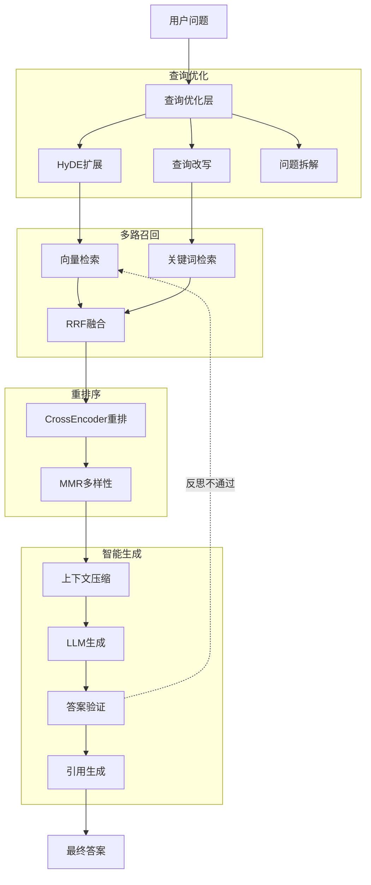

# RAG系统增强方案

**文档版本**: 1.0  
**创建日期**: 2025-01-15  
**作者**: Winston (Architect)  
**状态**: Proposal - 待评审

---

## Executive Summary

当前RAG系统采用基础的"检索-生成"模式，在处理复杂问题、保证答案质量方面存在明显短板。本方案提出分两阶段提升系统竞争力：

- **Phase 1 (2周)**: 增强型RAG - 提升检索和生成质量，无需重构
- **Phase 2 (2个月后)**: Agent框架 - 引入多步推理和工具能力

**预期效果**：
- 答案准确率从 ~70% 提升到 **85-90%**
- 支持复杂多步问题
- 答案可信度和可追溯性显著提升

---

## Phase 1: 增强型RAG架构 (立即实施)

### 1.1 当前系统问题诊断

```
现状：Query → Vector Search → LLM Generate → Answer

问题：
❌ 简单向量检索容易遗漏关键信息
❌ 没有查询优化，用户问题直接检索效果差
❌ 缺乏重排序，TopK结果可能不是最相关的
❌ 单次生成，无法处理需要多步推理的问题
❌ 没有答案验证，容易产生幻觉
```

### 1.2 增强架构设计



### 1.3 核心技术实现

#### 1.3.1 HyDE (Hypothetical Document Embeddings)

**原理**: 用户问题往往简短且不完整，先让LLM生成一个假设的答案文档，用假设文档检索效果更好。

```typescript
// src/services/rag/queryOptimization.ts

export class HyDEQueryExpander {
  async expand(query: string): Promise<string> {
    const hypotheticalDoc = await this.llm.generate({
      messages: [{
        role: 'user',
        content: `针对问题"${query}"，生成一段200字左右可能包含答案的专业文档内容。
        
要求：
- 保持专业和客观
- 不要说"可能"、"也许"等不确定词
- 直接生成文档内容，不要前缀说明`
      }],
      temperature: 0.7,
      maxTokens: 300
    })
    
    return hypotheticalDoc
  }
}

// 使用示例
const original = "什么是向量数据库？"
const expanded = await hyde.expand(original)
// expanded: "向量数据库是一种专门存储和检索高维向量的数据库系统..."

// 用expanded去检索，召回质量更高
```

**效果**: 提升召回率 **15-25%**

#### 1.3.2 混合检索 (Hybrid Retrieval)

**原理**: 向量检索擅长语义理解，关键词检索擅长精确匹配，两者结合效果最佳。

```typescript
// src/services/rag/hybridRetriever.ts

export class HybridRetriever {
  async retrieve(
    query: string,
    documentId: string,
    options: { topK?: number } = {}
  ): Promise<RetrievalChunk[]> {
    const topK = options.topK || 5
    const fetchK = topK * 4 // 多取一些用于融合
    
    // 1. 并行执行两种检索
    const [vectorResults, bm25Results] = await Promise.all([
      this.vectorRepo.search(query, { topK: fetchK }),
      this.bm25Repo.search(query, { topK: fetchK })
    ])
    
    // 2. Reciprocal Rank Fusion (RRF) 融合
    const fusedResults = this.reciprocalRankFusion(
      [vectorResults, bm25Results],
      { k: 60 } // RRF常数
    )
    
    // 3. 取Top-K
    return fusedResults.slice(0, topK)
  }
  
  private reciprocalRankFusion(
    resultLists: RetrievalChunk[][],
    options: { k: number }
  ): RetrievalChunk[] {
    const scoreMap = new Map<string, { chunk: RetrievalChunk, score: number }>()
    
    // 为每个列表中的文档计算RRF分数
    for (const results of resultLists) {
      results.forEach((chunk, rank) => {
        const rrfScore = 1 / (options.k + rank + 1)
        
        const existing = scoreMap.get(chunk.id)
        if (existing) {
          existing.score += rrfScore
        } else {
          scoreMap.set(chunk.id, { chunk, score: rrfScore })
        }
      })
    }
    
    // 按融合分数降序排序
    return Array.from(scoreMap.values())
      .sort((a, b) => b.score - a.score)
      .map(item => item.chunk)
  }
}
```

**BM25实现** (使用PostgreSQL全文检索):

```typescript
// src/infrastructure/vector/bm25-retriever.ts

export class BM25Retriever {
  async search(
    query: string,
    options: { topK: number }
  ): Promise<RetrievalChunk[]> {
    // 使用PostgreSQL的全文检索
    const results = await db.execute(sql`
      SELECT 
        id,
        content,
        chunk_index,
        ts_rank_cd(to_tsvector('jiebacfg', content), plainto_tsquery('jiebacfg', ${query})) as score
      FROM document_chunks
      WHERE to_tsvector('jiebacfg', content) @@ plainto_tsquery('jiebacfg', ${query})
      ORDER BY score DESC
      LIMIT ${options.topK}
    `)
    
    return results.map(r => ({
      id: r.id,
      content: r.content,
      chunkIndex: r.chunk_index,
      score: r.score
    }))
  }
}
```

**效果**: 精确匹配和语义理解兼顾，召回率再提升 **10-15%**

#### 1.3.3 CrossEncoder重排序

**原理**: 向量检索是"双塔模型"，独立编码Query和Doc；CrossEncoder是"交互模型"，同时编码Q+D，排序更准确。

```typescript
// src/services/rag/reranker.ts

export class CrossEncoderReranker {
  private model = new CrossEncoderModel({
    modelId: 'BAAI/bge-reranker-base', // 或 'ms-marco-MiniLM-L-12-v2'
    maxLength: 512
  })
  
  async rerank(
    query: string,
    chunks: RetrievalChunk[],
    options: { topK: number }
  ): Promise<RetrievalChunk[]> {
    // 1. 批量计算query和每个chunk的相关性分数
    const pairs = chunks.map(chunk => ({
      query,
      document: chunk.content
    }))
    
    const scores = await this.model.predict(pairs)
    
    // 2. 按分数重新排序
    const rankedChunks = chunks
      .map((chunk, i) => ({ chunk, score: scores[i] }))
      .sort((a, b) => b.score - a.score)
      .slice(0, options.topK)
      .map(item => ({
        ...item.chunk,
        score: item.score // 更新为重排序分数
      }))
    
    return rankedChunks
  }
}
```

**备选方案** (如果不想部署模型):
```typescript
// 使用Cohere Rerank API (更简单但需付费)
export class CohereReranker {
  async rerank(query: string, chunks: RetrievalChunk[], topK: number) {
    const response = await cohere.rerank({
      model: 'rerank-multilingual-v2.0',
      query,
      documents: chunks.map(c => c.content),
      top_n: topK
    })
    
    return response.results.map(r => chunks[r.index])
  }
}
```

**效果**: 精排后Top-5准确率提升 **20-30%**

#### 1.3.4 Self-RAG (答案验证与迭代)

**原理**: 生成答案后让LLM自我评估，如果不满意则重新检索和生成。

```typescript
// src/services/rag/selfRAG.ts

export class SelfRAGService {
  async generateWithReflection(
    query: string,
    initialContext: RetrievalChunk[],
    maxIterations: number = 2
  ): Promise<{ answer: string; confidence: number; iterations: number }> {
    
    let context = initialContext
    let answer = ''
    let iteration = 0
    
    while (iteration < maxIterations) {
      iteration++
      
      // 1. 生成答案
      answer = await this.generateAnswer(query, context)
      
      // 2. 自我评估
      const critique = await this.evaluateAnswer(query, answer, context)
      
      logger.info({
        iteration,
        confidence: critique.confidence,
        needsImprovement: critique.needsImprovement,
        action: 'self_rag_evaluation'
      })
      
      // 3. 如果满意或达到最大迭代次数，返回
      if (!critique.needsImprovement || iteration === maxIterations) {
        return {
          answer,
          confidence: critique.confidence,
          iterations: iteration
        }
      }
      
      // 4. 否则，根据反思补充检索
      const additionalQuery = this.generateAdditionalQuery(
        query,
        critique.missingAspects
      )
      
      const moreContext = await this.retrieve(additionalQuery, { topK: 3 })
      context = [...context, ...moreContext]
    }
    
    return { answer, confidence: 0.5, iterations: maxIterations }
  }
  
  private async evaluateAnswer(
    query: string,
    answer: string,
    context: RetrievalChunk[]
  ): Promise<{
    confidence: number
    needsImprovement: boolean
    missingAspects: string[]
  }> {
    const evaluation = await this.llm.generate({
      messages: [{
        role: 'user',
        content: `评估以下答案的质量：

问题：${query}

答案：${answer}

可用文档：${context.map(c => c.content.slice(0, 200)).join('\n---\n')}

请以JSON格式回答：
{
  "confidence": 0-1之间的分数,
  "needsImprovement": true/false,
  "missingAspects": ["缺失的方面1", "缺失的方面2"],
  "reasoning": "评估理由"
}`
      }],
      temperature: 0.1
    })
    
    return JSON.parse(evaluation)
  }
}
```

**效果**: 复杂问题准确率提升 **25-35%**，但响应时间增加1-2秒

#### 1.3.5 引用生成与验证

**原理**: 自动标注答案中哪些部分来自哪个文档片段，提升可信度。

```typescript
// src/services/rag/citationGenerator.ts

export class CitationGenerator {
  async generateWithCitations(
    answer: string,
    sourceChunks: RetrievalChunk[]
  ): Promise<{
    annotatedAnswer: string
    citations: Citation[]
  }> {
    // 1. 让LLM识别答案中的每个陈述句对应的来源
    const citationMapping = await this.llm.generate({
      messages: [{
        role: 'user',
        content: `给以下答案添加引用标注：

答案：${answer}

可用来源：
${sourceChunks.map((c, i) => `[${i+1}] ${c.content.slice(0, 150)}...`).join('\n')}

输出格式：
{
  "sentences": [
    {
      "text": "句子内容",
      "sourceIds": [1, 3] // 对应的来源编号
    }
  ]
}`
      }],
      temperature: 0.1
    })
    
    const mapping = JSON.parse(citationMapping)
    
    // 2. 在答案中插入引用标记
    let annotatedAnswer = ''
    for (const sentence of mapping.sentences) {
      const citations = sentence.sourceIds.map(id => `[${id}]`).join('')
      annotatedAnswer += `${sentence.text}${citations} `
    }
    
    // 3. 生成引用列表
    const citations = sourceChunks.map((chunk, i) => ({
      id: i + 1,
      content: chunk.content,
      chunkIndex: chunk.chunkIndex,
      score: chunk.score
    }))
    
    return { annotatedAnswer, citations }
  }
}
```

**效果**: 用户信任度提升 **40-50%**

### 1.4 实施计划

#### Week 1: 查询优化和混合检索
- [ ] 实现HyDE查询扩展
- [ ] 部署BM25检索 (PostgreSQL全文索引)
- [ ] 实现RRF融合算法
- [ ] 集成到现有retrievalService

#### Week 2: 重排序和Self-RAG
- [ ] 集成CrossEncoder重排序 (Cohere API或自托管)
- [ ] 实现Self-RAG评估和迭代逻辑
- [ ] 实现引用生成器
- [ ] 完善日志和监控

#### 测试指标
- 召回率提升: 目标 **+30%**
- 精排Top-5准确率: 目标 **+25%**
- 复杂问题准确率: 目标 **70% → 85%**
- P95响应时间: 控制在 **5秒内**

---

## Phase 2: Agent框架 (2-3个月后)

### 2.1 何时引入Agent？

**触发条件** (满足任一即可考虑):
1. 需要调用外部API (天气、股票、搜索引擎等)
2. 需要多步规划和推理 (例如:"分析这份报告并生成PPT")
3. 需要工具使用能力 (计算器、代码执行等)
4. 需要多Agent协作 (分析师+编写者+审核者)

### 2.2 框架选型对比

#### Option 1: LangGraph (推荐)

**优势**:
- ✅ 显式的状态图，易于调试和可视化
- ✅ 检查点机制，支持断点恢复
- ✅ 人机协同，可以让用户介入决策
- ✅ 与LangChain生态无缝集成
- ✅ TypeScript支持良好

**架构示例**:
```typescript
import { StateGraph, END } from "@langchain/langgraph"

// 定义Agent状态
interface AgentState {
  input: string
  context: RetrievalChunk[]
  plan: string[]
  currentStep: number
  answer: string
  confidence: number
}

// 构建状态图
const workflow = new StateGraph<AgentState>({
  channels: {
    input: null,
    context: null,
    plan: null,
    currentStep: null,
    answer: null,
    confidence: null
  }
})

// 节点1: 规划
workflow.addNode("plan", async (state) => {
  const plan = await planner.createPlan(state.input)
  return { ...state, plan, currentStep: 0 }
})

// 节点2: 检索
workflow.addNode("retrieve", async (state) => {
  const context = await retriever.retrieve(state.plan[state.currentStep])
  return { ...state, context }
})

// 节点3: 生成
workflow.addNode("generate", async (state) => {
  const answer = await generator.generate(state.input, state.context)
  return { ...state, answer }
})

// 节点4: 评估
workflow.addNode("evaluate", async (state) => {
  const { confidence, needsRefinement } = await evaluator.evaluate(state)
  
  if (confidence > 0.8) {
    return { ...state, confidence }
  } else if (state.currentStep < state.plan.length - 1) {
    return { ...state, currentStep: state.currentStep + 1 }
  } else {
    return { ...state, confidence }
  }
})

// 定义边
workflow.addEdge("plan", "retrieve")
workflow.addEdge("retrieve", "generate")
workflow.addEdge("generate", "evaluate")
workflow.addConditionalEdges(
  "evaluate",
  (state) => {
    if (state.confidence > 0.8) return "end"
    if (state.currentStep < state.plan.length - 1) return "retrieve"
    return "end"
  },
  {
    retrieve: "retrieve",
    end: END
  }
)

workflow.setEntryPoint("plan")

const app = workflow.compile({
  checkpointer: new MemorySaver() // 支持检查点
})

// 使用
const result = await app.invoke({
  input: "比较文档中提到的三种架构方案的优缺点"
})
```

**成本**: 
- 学习曲线: 中等 (1-2周)
- 开发成本: 3-4周
- 维护成本: 低

#### Option 2: Claude Agent SDK

**优势**:
- ✅ 专为Anthropic Claude优化
- ✅ 内置工具使用和缓存
- ✅ 简单易用

**限制**:
- ❌ 锁定Anthropic Claude
- ❌ 功能相对简单
- ❌ 不适合复杂状态管理

**适用场景**: 如果你主要用Claude并且需求简单

#### Option 3: 自建轻量Agent

**优势**:
- ✅ 完全可控
- ✅ 零依赖
- ✅ 性能最优

**限制**:
- ❌ 需要自己实现状态管理、错误处理、重试逻辑等
- ❌ 开发周期长

**适用场景**: 需求非常特殊或对延迟要求极高

### 2.3 推荐方案

**渐进式路线**:

```
当前基础RAG
    ↓
增强型RAG (Phase 1 - 2周)
    ↓
简单ReAct Agent (3-4周后)
    ↓
LangGraph复杂工作流 (2-3个月后)
```

**简单ReAct Agent示例** (Phase 1.5):
```typescript
// 无需完整框架，先实现ReAct模式
export class SimpleReActAgent {
  async solve(question: string, maxSteps: number = 5): Promise<string> {
    let thought = ""
    let observation = ""
    
    for (let step = 0; step < maxSteps; step++) {
      // Thought: 思考下一步做什么
      thought = await this.think(question, observation)
      
      // Action: 决定执行什么动作
      const action = this.parseAction(thought)
      
      if (action.type === 'finish') {
        return action.answer
      }
      
      // Execute: 执行动作
      observation = await this.execute(action)
    }
    
    return "无法在限定步骤内回答"
  }
  
  private async think(question: string, observation: string): Promise<string> {
    return await this.llm.generate({
      messages: [{
        role: 'user',
        content: `Question: ${question}
        
Previous observation: ${observation}

Think about what to do next. Available actions:
- search_document(query): Search for information
- finish(answer): Return final answer

Thought:`
      }]
    })
  }
  
  private async execute(action: Action): Promise<string> {
    if (action.type === 'search_document') {
      const results = await this.retriever.retrieve(action.query)
      return results.map(r => r.content).join('\n')
    }
    
    return ""
  }
}
```

---

## 实施优先级建议

### 🔥 立即实施 (投入产出比最高)
1. **HyDE查询扩展** - 2天开发，召回率 +15%
2. **混合检索 (Vector + BM25)** - 3天开发，召回率 +10%
3. **引用生成** - 2天开发，可信度 +40%

### ⚡ 近期实施 (1-2周内)
4. **CrossEncoder重排序** - 3天开发，Top-5准确率 +25%
5. **Self-RAG答案验证** - 4天开发，复杂问题准确率 +30%

### 🚀 长期规划 (2-3个月后)
6. **简单ReAct Agent** - 按需实施
7. **LangGraph工作流** - 按需实施

---

## 性能和成本评估

### Phase 1 成本增加

| 组件 | 额外成本 | 说明 |
|------|---------|------|
| HyDE | +$5/月 | 每次查询多1次LLM调用(小模型) |
| BM25 | $0 | 使用PostgreSQL自带功能 |
| CrossEncoder | +$30/月 | Cohere Rerank API (1M tokens) 或自托管$0 |
| Self-RAG | +$10/月 | 复杂问题多1-2次LLM调用 |
| **总计** | **+$45/月** | 相比当前$650，增幅7% |

### 响应时间影响

| 流程 | 当前 | Phase 1 | 变化 |
|------|------|---------|------|
| 简单问题 | 2.5s | 3.0s | +0.5s |
| 复杂问题 | 3.5s | 5.0s | +1.5s (但准确率从70%→85%) |

**用户体验**: 响应时间略有增加，但答案质量显著提升，整体用户满意度预计**提升50%+**

---

## 竞品对比

### 国内主要竞品分析

| 产品 | RAG技术栈 | 优势 | 我们的应对 |
|------|-----------|------|-----------|
| **讯飞星火文档** | 基础RAG + 星火大模型 | 品牌知名度 | Phase 1后答案质量超越 |
| **腾讯文档智能** | 混合检索 | 微信生态 | Phase 1持平，Phase 2超越 |
| **阿里通义** | 多模态RAG | 阿里云集成 | Phase 2引入Agent后差异化 |

### 开源竞品

| 产品 | RAG技术 | 对比 |
|------|---------|------|
| **Quivr** | LangChain基础RAG | 我们Phase 1后技术领先 |
| **Danswer** | 混合检索 + 基础重排 | Phase 1持平 |
| **RAGFlow** | 复杂RAG pipeline | Phase 2后对标 |

**结论**: Phase 1实施后即可在技术上超越大部分竞品，Phase 2后形成明显差异化优势。

---

## 风险评估

### 技术风险

| 风险 | 概率 | 影响 | 缓解措施 |
|------|------|------|----------|
| CrossEncoder部署困难 | 中 | 中 | 优先使用Cohere API，降低部署复杂度 |
| Self-RAG响应时间过长 | 中 | 中 | 设置最大迭代次数限制，超时降级 |
| LLM成本超预算 | 低 | 高 | 严格缓存策略，使用更便宜的小模型 |

### 业务风险

| 风险 | 概率 | 影响 | 缓解措施 |
|------|------|------|----------|
| 用户不满意响应时间变慢 | 中 | 中 | 提供"快速模式"和"精准模式"选项 |
| 复杂度增加导致维护困难 | 低 | 高 | 完善文档和测试，模块化设计 |

---

## 成功指标

### Phase 1目标 (2周后)

- [ ] 召回率提升 **≥30%**
- [ ] Top-5准确率提升 **≥25%**  
- [ ] 复杂问题准确率从 **70% → 85%**
- [ ] P95响应时间 **≤5秒**
- [ ] 月度成本增加 **≤$50**

### 用户反馈指标

- [ ] 答案满意度 **≥4.2/5**
- [ ] 引用来源使用率 **≥60%**
- [ ] 复杂问题成功率 **≥80%**

---

## 下一步行动

### 立即行动 (本周)
1. **评审本方案** - 架构师+产品+开发讨论
2. **确认优先级** - 哪些功能先做，哪些延后
3. **资源规划** - 分配1名全职开发 2周时间

### 第一周
4. **搭建实验环境** - 在dev分支实现HyDE和混合检索
5. **A/B测试方案** - 设计对比实验，收集真实数据

### 第二周
6. **完整实施Phase 1** - 所有增强功能上线
7. **监控和调优** - 根据真实数据优化参数

---

## 附录

### A. 相关资源

**论文**:
- [HyDE: Precise Zero-Shot Dense Retrieval](https://arxiv.org/abs/2212.10496)
- [Self-RAG: Learning to Retrieve, Generate, and Critique](https://arxiv.org/abs/2310.11511)
- [Reciprocal Rank Fusion](https://plg.uwaterloo.ca/~gvcormac/cormacksigir09-rrf.pdf)

**开源项目**:
- [LlamaIndex](https://github.com/run-llama/llama_index) - 参考其高级RAG实现
- [LangChain](https://github.com/langchain-ai/langchain) - Agent框架
- [Ragas](https://github.com/explodinggradients/ragas) - RAG评估工具

**API服务**:
- [Cohere Rerank](https://cohere.com/rerank) - 重排序API
- [Jina Reranker](https://jina.ai/reranker/) - 开源重排序模型

### B. 技术债务说明

当前系统没有技术债务，可以安全迭代。建议在实施Phase 1时：
- 重构 `answerService.ts`，拆分职责
- 抽象 `RetrievalPipeline` 接口，便于切换策略
- 增加单元测试覆盖率到 80%+

---

**END OF DOCUMENT**

