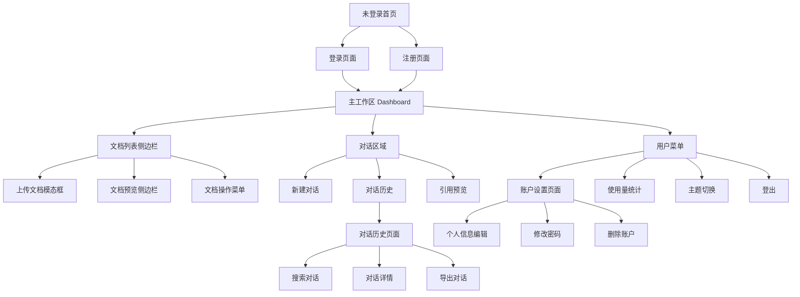
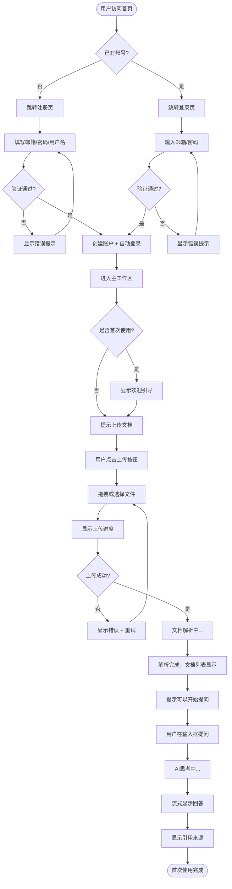
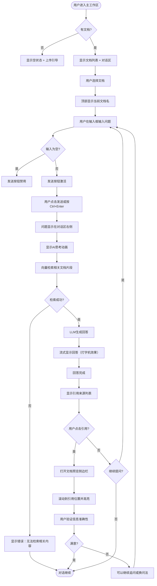
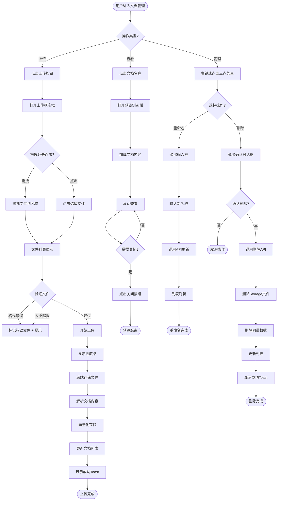

# 智能文档问答系统 UI/UX Specification

**项目名称**: DocQA System - 智能文档问答系统  
**文档版本**: 1.0  
**创建日期**: 2025年1月  
**作者**: Sally (UX Expert)  
**状态**: Draft  

---

## Introduction

本文档定义智能文档问答系统的用户体验目标、信息架构、用户流程和视觉设计规范。它作为视觉设计和前端开发的基础，确保一致且以用户为中心的体验。

### Overall UX Goals & Principles

#### Target User Personas

基于PRD的目标用户分析，我们定义了三个核心用户画像：

**1. 企业知识工作者 - 产品经理小张**
- **背景**：28-35岁，产品经理/项目经理，50-500人成长型企业
- **技术能力**：中等，熟悉常见SaaS工具
- **使用场景**：每天查阅10+份文档（PRD、技术文档、会议纪要）
- **核心需求**：快速检索信息、团队协作、知识传承
- **痛点**：信息分散、查找效率低、新人培训成本高
- **使用频率**：每天2-3次，每次15-30分钟

**2. 学术研究人员 - 研究生小李**
- **背景**：22-30岁，硕士/博士研究生
- **技术能力**：较高，熟悉学术工具（Zotero、Mendeley）
- **使用场景**：撰写论文、文献综述，每月阅读20-50篇论文
- **核心需求**：批量文献处理、精确引用、对比分析
- **痛点**：阅读效率低、跨文献整合难、引用管理繁琐
- **使用频率**：每周3-5次，每次1-2小时

**3. 个人学习者 - 自由职业者老王**
- **背景**：25-40岁，内容创作者/技术爱好者
- **技术能力**：中高，追求效率工具
- **使用场景**：个人知识管理、学习资料整理
- **核心需求**：个人知识库、高效学习、创意激发
- **痛点**：收藏不看、信息过载、知识碎片化
- **使用频率**：每周2-3次，每次30-60分钟

---

#### Usability Goals

**1. 极易学习（Ease of Learning）**
- ✅ 新用户能在**5分钟内**完成"上传文档→提问→获得答案"的完整流程
- ✅ 无需阅读任何说明文档即可开始使用
- ✅ 关键操作有清晰的视觉引导

**2. 高效使用（Efficiency）**
- ✅ 核心操作（上传、提问、查看引用）不超过**3次点击**
- ✅ 支持键盘快捷键提升效率
- ✅ 智能预填充和自动补全

**3. 错误预防（Error Prevention）**
- ✅ 所有破坏性操作（删除文档、清空对话）需二次确认
- ✅ 实时验证用户输入（文件格式、大小）
- ✅ 明确的错误提示和恢复建议

**4. 易于记忆（Memorability）**
- ✅ 一致的交互模式（所有删除都用相同的流程）
- ✅ 清晰的视觉层级和信息组织
- ✅ 重要功能位置固定，不随内容变化

**5. 用户满意度（Satisfaction）**
- ✅ 美观、现代的界面设计
- ✅ 流畅的动画和过渡效果
- ✅ 即时反馈让用户感到系统响应迅速

---

#### Design Principles

我们遵循以下5大核心设计原则：

**1. 简洁至上（Simplicity First）**
- 界面元素最小化，只保留核心功能
- 避免过度设计和不必要的装饰
- 每个屏幕专注于一个主要任务
- *应用示例*：主工作区只有文档列表和对话区域，设置功能折叠到菜单

**2. 即时反馈（Immediate Feedback）**
- 每个用户操作必须有清晰的视觉反馈
- 加载状态用Skeleton或进度条明确显示
- 成功/失败操作用Toast通知
- *应用示例*：文档上传显示实时进度条，问答时显示打字机效果

**3. 渐进式披露（Progressive Disclosure）**
- 高级功能隐藏在二级菜单，不干扰主流程
- 首次使用时提供引导，熟悉后可关闭
- 根据用户操作动态显示相关选项
- *应用示例*：文档操作菜单（重命名、删除）通过右键或三点菜单访问

**4. 信息层级清晰（Clear Hierarchy）**
- 重要信息使用更大字号和更高对比度
- 次要信息视觉弱化（灰色、小字）
- 使用留白分隔不同功能区域
- *应用示例*：AI回答突出显示，引用来源用较小字体列在下方

**5. 一致性原则（Consistency）**
- 所有删除操作都需二次确认
- 所有表单都采用相同的验证样式
- 所有按钮都遵循相同的状态设计
- *应用示例*：主按钮统一用蓝色，危险操作统一用红色

---

### Change Log

| Date | Version | Description | Author |
|------|---------|-------------|--------|
| 2025-01 | 1.0 | Initial UI/UX specification based on PRD | Sally (UX Expert) |

---

## Information Architecture (IA)

### Site Map / Screen Inventory



**核心界面清单**：
1. 登录页面 (`/login`)
2. 注册页面 (`/register`)
3. 主工作区 (`/dashboard`) - **最核心**
4. 账户设置页面 (`/settings`)
5. 对话历史页面 (`/conversations`)
6. 对话详情页面 (`/conversations/[id]`)

---

### Navigation Structure

**Primary Navigation**：
- **位置**：顶部Header固定
- **内容**：
  - 左侧：Logo + "DocQA"文字
  - 右侧：用户头像下拉菜单
- **始终可见**：是（除了登录/注册页）

**Secondary Navigation**：
- **位置**：左侧Sidebar（可折叠）
- **内容**：
  - 文档列表（带搜索框）
  - "新建对话"按钮
  - "对话历史"链接
  - "使用量"快速预览
- **折叠行为**：点击左上角汉堡菜单折叠/展开

**Breadcrumb Strategy**：
- **不使用面包屑**：应用结构扁平，导航层级不深
- 替代方案：在对话详情页顶部显示"← 返回对话列表"链接

**Mobile适配**（Phase 2）：
- 主导航收起到汉堡菜单
- 文档列表和对话区域分屏显示，可左右滑动切换

---

## User Flows

### Flow 1: 新用户注册与首次使用

**User Goal**: 新用户快速完成注册，上传第一个文档并体验问答功能

**Entry Points**: 
- 首页"开始使用"按钮
- 登录页"还没有账号？注册"链接

**Success Criteria**: 
- 用户成功创建账户
- 完成首个文档上传
- 成功提问并获得回答
- 总耗时≤5分钟

#### Flow Diagram



#### Edge Cases & Error Handling

- **邮箱已存在**：显示"该邮箱已注册，请直接登录"并提供登录链接
- **密码强度不够**：实时显示密码强度指示器，不符合要求时禁用提交按钮
- **OAuth失败**：显示"第三方登录失败，请稍后重试或使用邮箱登录"
- **文件格式不支持**：上传前验证，不符合时显示"请上传PDF、Word、Markdown或TXT文件"
- **文件过大**：显示"文件大小不能超过50MB，请压缩或分割文件"
- **解析失败**：显示"文档解析失败，请检查文件是否损坏"并允许重新上传
- **网络中断**：显示"网络连接中断，请检查网络后重试"

**Notes**: 首次使用体验至关重要，每一步都要有清晰的视觉引导和即时反馈。

---

### Flow 2: 日常使用 - 文档问答

**User Goal**: 已登录用户快速对已上传文档提问并获得答案

**Entry Points**:
- 主工作区默认视图
- 从对话历史恢复之前的对话

**Success Criteria**:
- 用户能在3次点击内开始提问
- 问答响应时间≤3秒
- 引用可以快速跳转查看

#### Flow Diagram



#### Edge Cases & Error Handling

- **未选择文档直接提问**：提示"请先选择要提问的文档"
- **问题超长**：限制输入框最大字符数（如1000字符），超出时显示提示
- **API调用失败**：显示"服务暂时不可用，请稍后重试"并允许重新发送
- **回答生成超时**：10秒后显示"生成超时，请重新提问"
- **配额耗尽**：显示"今日问答次数已达上限，明天再来或升级到专业版"
- **引用定位失败**：如果无法精确定位，显示文档首页并提示"引用位置可能不准确"

**Notes**: 流式输出要流畅，打字机效果速度适中（约50字符/秒）。

---

### Flow 3: 文档管理

**User Goal**: 用户上传、查看、管理自己的文档库

**Entry Points**:
- 主工作区左侧文档列表
- "上传文档"按钮

**Success Criteria**:
- 批量上传10个文件≤3分钟
- 文档重命名/删除操作流畅
- 文档预览加载时间≤2秒

#### Flow Diagram



#### Edge Cases & Error Handling

- **批量上传部分失败**：成功的继续，失败的标记并允许重试
- **上传过程中断**：显示"上传中断，请重试"并清理临时文件
- **重命名重复**：提示"已存在同名文档，请使用其他名称"
- **删除时文档正在使用**：警告"该文档正在对话中使用，删除后对话历史将无法查看引用"
- **预览加载失败**：显示"无法加载文档预览，请稍后重试"
- **存储空间满**：提示"存储空间已满（X/1GB），请删除旧文档或升级"

**Notes**: 上传多个文件时显示整体进度和每个文件的独立进度。

---

### Flow 4: 对话历史管理与导出

**User Goal**: 查看过往对话记录，导出有价值的内容

**Entry Points**:
- 左侧边栏"对话历史"链接
- 主工作区顶部"查看所有对话"

**Success Criteria**:
- 能快速搜索到需要的对话
- 导出格式美观易读
- 导出时间≤3秒

#### Flow Diagram

```mermaid
graph TD
    Start([用户点击对话历史]) --> A[跳转到对话历史页面]
    A --> B[加载对话列表]
    B --> C{有对话记录?}
    C -->|否| D[显示空状态]
    D --> End1([引导创建新对话])
    
    C -->|是| E[显示对话列表]
    E --> F{用户操作?}
    
    F -->|搜索| G[输入关键词]
    G --> H[前端过滤列表]
    H --> E
    
    F -->|过滤| I[选择文档/时间范围]
    I --> J[更新列表]
    J --> E
    
    F -->|查看详情| K[点击对话卡片]
    K --> L[跳转到对话详情页]
    L --> M[显示完整对话内容]
    M --> N{用户操作?}
    
    N -->|导出| O[点击导出按钮]
    O --> P[生成Markdown格式]
    P --> Q[浏览器下载文件]
    Q --> R[显示成功Toast]
    R --> End2([导出完成])
    
    N -->|复制| S[点击复制按钮]
    S --> T[复制到剪贴板]
    T --> U[显示"已复制"提示]
    U --> End3([复制完成])
    
    N -->|删除| V[点击删除按钮]
    V --> W[弹出确认对话框]
    W --> X{确认删除?}
    X -->|否| M
    X -->|是| Y[调用删除API]
    Y --> Z[更新列表]
    Z --> AA[跳回对话历史页]
    AA --> End4([删除完成])
    
    F -->|返回| End5([返回主工作区])
```

#### Edge Cases & Error Handling

- **搜索无结果**：显示"未找到匹配的对话"并建议"尝试其他关键词"
- **导出失败**：显示"导出失败，请稍后重试"并记录错误日志
- **网络慢导致加载长时间**：显示Skeleton加载状态，超过10秒提示"加载较慢，请稍候"
- **删除多个对话**：暂不支持批量删除（MVP），提示"请逐个删除"

**Notes**: 导出的Markdown文件要格式美观，包含标题、时间戳、引用来源等完整信息。

---

## Wireframes & Mockups

### Primary Design Files

**设计工具**: 本项目使用 Figma 进行UI设计

**设计文件链接**: [待创建 - 建议使用Figma Community中的shadcn/ui设计系统作为起点]

**设计交付物**：
- 低保真线框图（Wireframes）- 用于快速验证布局
- 高保真视觉稿（Mockups）- 用于开发参考
- 交互原型（Prototype）- 用于用户测试

---

### Key Screen Layouts

#### Screen 1: 登录页面 (`/login`)

**Purpose**: 让用户快速安全地登录系统，同时提供注册入口

**Key Elements**:
- **中央卡片**：400px宽，垂直居中
  - Logo + "DocQA" 标题
  - 邮箱输入框（带验证图标）
  - 密码输入框（带显示/隐藏图标）
  - "记住我"复选框
  - 主按钮："登录"（蓝色，全宽）
- **OAuth按钮组**：
  - "使用Google登录"（白底，Google图标）
  - "使用GitHub登录"（深色，GitHub图标）
- **分隔线**：中间有"OR"文字
- **底部链接**：
  - "还没有账号？注册"（链接到注册页）
  - "忘记密码？"（暂不实现，显示为灰色文本）

**Interaction Notes**:
- 输入框获得焦点时显示蓝色边框
- 实时验证邮箱格式，无效时显示红色边框和错误提示
- 登录按钮在输入未填完时禁用（灰色）
- 登录失败时在卡片顶部显示红色Alert条

**Design File Reference**: `figma.com/file/xxx/login-page`

---

#### Screen 2: 主工作区 (`/dashboard`)

**Purpose**: 核心界面，用户完成90%的操作（上传、问答、查看引用）

**布局结构**:
```
┌─────────────────────────────────────────────────────┐
│  [Logo] DocQA        [搜索] [通知] [用户头像▼]      │ ← Header (固定顶部)
├───────────┬─────────────────────────────────────────┤
│           │                                         │
│ 📁 我的文档│         💬 对话区域                     │
│           │                                         │
│ [搜索框]   │   [选择文档: Product Handbook ▼]       │
│           │   ┌─────────────────────────────────┐  │
│ • 手册.pdf │   │ 用户: 产品路线图是什么？        │  │
│ • 报告.docx│   │ AI: 根据《手册.pdf》第5页...    │  │
│ • 笔记.md  │   │     [查看引用]                  │  │
│           │   │                                 │  │
│ [上传文档] │   └─────────────────────────────────┘  │
│           │                                         │
│ 对话历史   │   [输入问题...]            [发送]      │
│           │                                         │
└───────────┴─────────────────────────────────────────┘
    240px              自适应宽度
   (可折叠)
```

**Key Elements**:

**1. Header (固定顶部，高度64px)**
- 左侧：Logo + "DocQA"
- 中间：全局搜索框（暂不实现，显示"搜索文档和对话..."占位）
- 右侧：
  - 通知图标（红点badge显示未读数）
  - 用户头像（下拉菜单：设置、使用量、主题切换、登出）

**2. 左侧边栏 (宽度240px，可折叠到64px)**
- **文档列表**：
  - 顶部搜索框（实时过滤）
  - 文档卡片（每个显示图标、名称、时间、状态）
  - 空状态：显示上传引导插画
- **底部固定区域**：
  - "上传文档"按钮（主要，蓝色）
  - "对话历史"链接
  - 使用量进度条（小）

**3. 主内容区（对话区域）**
- **顶部工具栏**：
  - 文档选择下拉框（显示当前文档名）
  - "新建对话"按钮（次要，灰色）
  - 三点菜单（导出对话、清空对话）
- **对话消息列表**：
  - 用户消息：右对齐，蓝色背景气泡
  - AI消息：左对齐，白色背景卡片
    - 头像（AI图标）
    - 消息内容（Markdown渲染）
    - 引用列表（可折叠）
    - 操作按钮（复制、重新生成）
- **底部输入区（固定）**：
  - 多行文本框（自动扩展，最多5行）
  - 格式工具栏（粗体、代码、列表）
  - 发送按钮（输入为空时禁用）
  - 快捷键提示："Ctrl+Enter发送"

**Interaction Notes**:
- 侧边栏折叠后只显示图标
- 文档卡片hover时显示操作菜单（...）
- 对话区域自动滚动到最新消息
- 引用点击后右侧滑出文档预览（占40%宽度）
- 输入框支持拖拽上传文件（作为上传文档的快捷方式）

**Responsive Behavior**:
- **桌面 (>1280px)**: 完整布局
- **小桌面 (1024-1280px)**: 侧边栏自动折叠
- **平板 (768-1024px)**: 侧边栏覆盖式展开，点击遮罩层关闭
- **手机 (<768px)**: MVP不优化，显示"请在桌面端使用"提示

**Design File Reference**: `figma.com/file/xxx/dashboard`

---

#### Screen 3: 文档上传模态框

**Purpose**: 让用户快速上传单个或多个文档

**Layout**:
```
┌────────────────────────────────────┐
│  上传文档                      [×]  │ ← Header
├────────────────────────────────────┤
│                                    │
│   ╔════════════════════════════╗   │
│   ║   📄                       ║   │
│   ║                            ║   │
│   ║   拖拽文件到这里           ║   │
│   ║   或                        ║   │
│   ║   [点击选择文件]           ║   │
│   ║                            ║   │
│   ║   支持PDF、Word、Markdown  ║   │
│   ║   最大50MB                 ║   │
│   ╚════════════════════════════╝   │
│                                    │
│   已选文件 (2)                     │
│   • 产品手册.pdf    [4.2MB]  [×]  │
│   • 会议纪要.docx   [1.1MB]  [×]  │
│                                    │
├────────────────────────────────────┤
│            [取消]  [开始上传(2)]   │ ← Footer
└────────────────────────────────────┘
```

**Key Elements**:
- **拖拽区域**：
  - 高度300px，虚线边框
  - 拖拽时变为蓝色实线边框
  - 中央图标和文字引导
- **文件列表**：
  - 每个文件显示名称、大小、删除按钮
  - 超过5个文件时滚动显示
  - 格式错误的文件标红并显示错误原因
- **底部按钮**：
  - "取消"：关闭模态框
  - "开始上传"：禁用状态直到选择文件

**Interaction Notes**:
- 点击拖拽区域等同于点击"选择文件"
- 支持批量选择（Ctrl/Cmd多选）
- 上传开始后显示每个文件的进度条
- 上传完成后自动关闭模态框，显示Toast

**Design File Reference**: `figma.com/file/xxx/upload-modal`

---

#### Screen 4: 账户设置页面 (`/settings`)

**Purpose**: 让用户管理个人信息和查看使用量统计

**Layout**:
```
┌─────────────────────────────────────────────────────┐
│  [Logo] DocQA        [搜索] [通知] [用户头像▼]      │
├─────────────────────────────────────────────────────┤
│                                                     │
│  账户设置                              [返回主页]   │
│                                                     │
│  ┌───────────────────────────────────────────┐     │
│  │ 个人信息                                  │     │
│  │                                           │     │
│  │ 头像:  [📷]  [更换头像]                   │     │
│  │ 邮箱:  user@example.com (已验证)          │     │
│  │ 用户名: [John Doe]          [保存]        │     │
│  │ 注册时间: 2025年1月10日                   │     │
│  │                                           │     │
│  │                            [修改密码]      │     │
│  └───────────────────────────────────────────┘     │
│                                                     │
│  ┌───────────────────────────────────────────┐     │
│  │ 使用量统计                                │     │
│  │                                           │     │
│  │ 文档数量:  5 / 50                         │     │
│  │ ████████░░░░░░░░░░░░░░░░  10%            │     │
│  │                                           │     │
│  │ 存储空间:  120MB / 1GB                    │     │
│  │ ███░░░░░░░░░░░░░░░░░░░░░  12%            │     │
│  │                                           │     │
│  │ 问答次数:  45 / 100 (本月)                │     │
│  │ ███████████░░░░░░░░░░░░░  45%            │     │
│  │                                           │     │
│  │ 账户类型:  免费版            [升级]       │     │
│  └───────────────────────────────────────────┘     │
│                                                     │
│  ┌───────────────────────────────────────────┐     │
│  │ 偏好设置                                  │     │
│  │                                           │     │
│  │ 主题:  ○ 明亮  ● 暗色  ○ 跟随系统        │     │
│  │ 语言:  [中文 ▼]                           │     │
│  └───────────────────────────────────────────┘     │
│                                                     │
│  ┌───────────────────────────────────────────┐     │
│  │ 危险区域                                  │     │
│  │                                           │     │
│  │ 删除账户会永久删除所有数据，无法恢复      │     │
│  │                     [删除我的账户]         │     │
│  └───────────────────────────────────────────┘     │
│                                                     │
└─────────────────────────────────────────────────────┘
```

**Key Elements**:
- **卡片式布局**：每个功能区域用卡片分隔
- **使用量进度条**：
  - 绿色（<50%）
  - 黄色（50-80%）
  - 红色（>80%）
- **危险操作**：红色文字和边框，按钮也用红色

**Interaction Notes**:
- 修改用户名后点击"保存"，成功后显示Toast
- 修改密码弹出模态框，需验证旧密码
- 删除账户需二次确认："请输入您的邮箱以确认删除"
- 升级按钮跳转到定价页面（Phase 2）
- **主题切换**（基于 Story 1.8 实施）：
  - Header右上角显示 `ThemeToggle` 组件（月亮/太阳图标）
  - 点击打开下拉菜单，显示三个选项：Light / Dark / System
  - 设置页面提供完整的主题配置界面（单选按钮组）
  - 主题切换有 200ms 平滑过渡动画（由 CSS Variables 实现）
  - 用户选择自动保存到 `localStorage`（由 `next-themes` 管理）
  - 支持 `prefers-color-scheme` 媒体查询（System 模式）

**Design File Reference**: `figma.com/file/xxx/settings`

---

#### Screen 5: 对话历史页面 (`/conversations`)

**Purpose**: 让用户浏览、搜索和管理所有历史对话

**Layout**:
```
┌─────────────────────────────────────────────────────┐
│  [Logo] DocQA        [搜索] [通知] [用户头像▼]      │
├─────────────────────────────────────────────────────┤
│                                                     │
│  对话历史                              [返回主页]   │
│                                                     │
│  [搜索对话...]              [筛选▼] [排序▼]         │
│                                                     │
│  ┌───────────────────────────────────────────┐     │
│  │ 💬 产品路线图讨论                         │     │
│  │    关联文档: 产品手册.pdf                 │     │
│  │    5条消息 · 2小时前              [...] │     │
│  └───────────────────────────────────────────┘     │
│                                                     │
│  ┌───────────────────────────────────────────┐     │
│  │ 💬 技术架构问题                           │     │
│  │    关联文档: 架构文档.md                  │     │
│  │    12条消息 · 昨天                [...] │     │
│  └───────────────────────────────────────────┘     │
│                                                     │
│  ┌───────────────────────────────────────────┐     │
│  │ 💬 API使用说明                            │     │
│  │    关联文档: API文档.pdf                  │     │
│  │    3条消息 · 3天前                [...] │     │
│  └───────────────────────────────────────────┘     │
│                                                     │
│                      [加载更多]                     │
│                                                     │
└─────────────────────────────────────────────────────┘
```

**Key Elements**:
- **搜索框**：实时过滤对话标题和内容
- **筛选器**：按文档、按时间范围
- **排序**：最新优先、最旧优先、消息数量
- **对话卡片**：
  - 对话图标（💬）
  - 标题（自动生成或手动命名）
  - 关联文档（带文件图标）
  - 元信息（消息数、时间）
  - 操作菜单（查看、导出、删除）

**Interaction Notes**:
- 点击卡片主体区域跳转到对话详情
- 点击三点菜单显示快捷操作
- 空状态显示"还没有对话记录"和"开始新对话"按钮
- 滚动到底部自动加载更多（无限滚动）

**Design File Reference**: `figma.com/file/xxx/conversations`

---

#### Screen 6: 文档预览侧边栏

**Purpose**: 让用户快速查看文档原文并跳转到引用位置

**Layout**: 从右侧滑出，占据40%屏幕宽度

```
┌─────────────────────────────────────┐
│  产品手册.pdf (第5页)          [×]  │ ← Header
├─────────────────────────────────────┤
│                                     │
│  产品路线图                          │
│                                     │
│  我们的产品将在2025年Q1推出以下      │
│  核心功能：                          │
│                                     │
│  ╔═════════════════════════════╗    │ ← 引用高亮
│  ║ 1. 智能文档问答             ║    │
│  ║ 2. 多文档联合分析           ║    │
│  ║ 3. 团队协作功能             ║    │
│  ╚═════════════════════════════╝    │
│                                     │
│  这些功能将帮助企业提升知识管理      │
│  效率，减少信息查找时间...          │
│                                     │
│                                     │
│                                     │
└─────────────────────────────────────┘
```

**Key Elements**:
- **Header**：文档名 + 页码 + 关闭按钮
- **内容区域**：
  - 滚动查看完整文档
  - 引用段落用黄色背景高亮
  - 支持缩放（Ctrl + 滚轮）
- **Footer（可选）**：
  - "在新标签打开完整文档"链接

**Interaction Notes**:
- 打开时自动滚动到引用位置
- 高亮区域在2秒后淡出（仍可点击再次高亮）
- 点击遮罩层关闭侧边栏
- 支持键盘Esc关闭

**Design File Reference**: `figma.com/file/xxx/document-preview`

---

## Component Library / Design System

### Design System Approach

**采用策略**: 基于 **shadcn/ui + Tailwind CSS** 构建自定义设计系统

**理由**:
- shadcn/ui提供高质量、可定制的React组件
- Tailwind CSS提供灵活的样式系统
- 组件可复制到项目中，完全掌控
- 社区活跃，文档完善

**组件来源**:
1. **基础组件**：从shadcn/ui复制（Button、Input、Dialog等）
2. **定制组件**：基于基础组件扩展（DocumentCard、MessageBubble等）
3. **布局组件**：自行创建（DashboardLayout、Sidebar等）

**设计Token管理**: 使用Tailwind配置文件统一管理

**主题定制工具**: [**tweakcn - shadcn/ui Theme Editor**](https://tweakcn.com/editor/theme)
- 🎨 可视化编辑所有颜色变量（Primary、Secondary、Accent等）
- 👀 实时预览所有组件效果（Button、Card、Dialog等）
- 💾 一键导出CSS变量代码
- 📤 支持导出到Figma
- 🌓 同时支持明亮和暗色模式配置

**推荐工作流**:
1. 在tweakcn中配置基于我们色彩系统的主题
2. 实时预览确保所有组件颜色协调
3. 导出CSS变量代码到`globals.css`
4. 所有shadcn/ui组件自动应用主题

---

### Core Components

#### Component 0: Theme System Components (Story 1.8)

**新增主题系统组件** - 基于 Story 1.8 实施

**ThemeProvider**
- **Purpose**: 包裹整个应用，提供主题上下文
- **Location**: `src/components/providers/ThemeProvider.tsx`
- **Props**:
  - `attribute`: 'class' (使用 class 切换主题)
  - `defaultTheme`: 'system' | 'light' | 'dark'
  - `enableSystem`: boolean (是否支持系统主题)
  - `disableTransitionOnChange`: boolean (禁用切换时的过渡)
- **Usage**:
  ```tsx
  // src/app/layout.tsx
  <ThemeProvider attribute="class" defaultTheme="system" enableSystem>
    <SessionProvider>{children}</SessionProvider>
  </ThemeProvider>
  ```

**ThemeToggle**
- **Purpose**: 主题切换器组件
- **Location**: `src/components/ui/theme-toggle.tsx`
- **Variants**:
  - **Dropdown Menu（桌面端）**: Sun/Moon 图标 + 下拉菜单（Light/Dark/System）
  - **Toggle Button（移动端）**: 简化为 Light ⇄ Dark 切换
- **Placement**: Header 右上角，用户头像左侧
- **Keyboard Support**: Enter/Space 打开菜单，Esc 关闭
- **Usage**:
  ```tsx
  <Header>
    <Logo />
    <Navigation />
    <ThemeToggle />  {/* 主题切换器 */}
    <UserMenu />
  </Header>
  ```

#### Component 1: Button

**Purpose**: 统一的按钮组件，支持多种变体和状态

**Variants**:
- **Primary（主要）**: 蓝色背景，白色文字，用于主要操作
- **Secondary（次要）**: 灰色边框，黑色文字，用于次要操作
- **Destructive（危险）**: 红色背景，白色文字，用于删除等危险操作
- **Ghost（幽灵）**: 透明背景，仅hover时显示背景
- **Link（链接）**: 无背景，下划线，像文本链接

**States**:
- Default: 正常状态
- Hover: 背景颜色加深10%
- Active: 背景颜色加深20%
- Disabled: 透明度50%，禁止点击
- Loading: 显示Spinner图标，文字改为"处理中..."

**Sizes**:
- **sm**: 高度32px，padding 8px 12px，文字14px
- **md**: 高度40px，padding 12px 16px，文字16px（默认）
- **lg**: 高度48px，padding 16px 24px，文字18px

**Usage Guidelines**:
- 同一区域最多1个Primary按钮
- 破坏性操作必须二次确认
- Loading状态禁用所有交互
- 按钮文字使用动词（"上传文档"而非"文档上传"）

**Code Example**:
```tsx
<Button variant="primary" size="md">
  上传文档
</Button>

<Button variant="destructive" size="sm" onClick={handleDelete}>
  删除
</Button>
```

---

#### Component 2: Input

**Purpose**: 统一的输入框组件，支持多种类型和验证状态

**Variants**:
- **Text（文本）**: 单行文本输入
- **Password（密码）**: 密码输入，带显示/隐藏图标
- **Textarea（多行）**: 多行文本输入，自动扩展
- **Search（搜索）**: 带搜索图标，支持清空按钮

**States**:
- Default: 正常状态，灰色边框
- Focus: 蓝色边框，外发光效果
- Error: 红色边框，显示错误提示
- Success: 绿色边框，显示成功图标
- Disabled: 灰色背景，禁止输入

**Usage Guidelines**:
- 必填字段标记红色星号(*)
- 实时验证，失去焦点时显示错误
- 错误提示显示在输入框下方，红色文字
- Placeholder使用灰色文字，简洁明了

---

#### Component 3: Card

**Purpose**: 内容容器，用于分组相关信息

**Variants**:
- **Default**: 白色背景，浅灰边框，圆角8px
- **Hover**: hover时边框颜色加深，轻微上浮效果
- **Selected**: 蓝色边框，表示选中状态

**Structure**:
- **Header**: 标题 + 可选操作按钮
- **Body**: 主要内容区域
- **Footer**: 次要信息或操作

**Usage Guidelines**:
- 用于文档卡片、对话卡片、设置分组
- 卡片间距16px
- 避免嵌套过深（最多2层）

---

#### Component 4: Dialog / Modal

**Purpose**: 模态对话框，用于需要用户关注的操作

**Variants**:
- **Standard**: 中等尺寸（500px宽），居中显示
- **Large**: 大尺寸（800px宽），用于复杂表单
- **Full Screen**: 全屏，用于文档预览

**Structure**:
- **Header**: 标题 + 关闭按钮（右上角×）
- **Content**: 主要内容
- **Footer**: 操作按钮（右对齐，取消在左，主操作在右）

**Interaction**:
- 背景半透明黑色遮罩（opacity 0.5）
- 点击遮罩或按Esc关闭
- 危险操作需二次确认

**Usage Guidelines**:
- 避免多层嵌套Modal
- 关键信息放在第一屏，避免滚动
- 按钮文字明确操作内容

---

#### Component 5: Toast / Notification

**Purpose**: 非阻塞式通知，用于操作反馈

**Variants**:
- **Success**: 绿色，显示成功图标✓
- **Error**: 红色，显示错误图标✗
- **Warning**: 黄色，显示警告图标⚠
- **Info**: 蓝色，显示信息图标ⓘ

**Behavior**:
- 从右上角滑入
- 默认显示3秒后自动消失
- 可手动点击×关闭
- 最多同时显示3个，超过则排队

**Usage Guidelines**:
- 简短文字（<50字符）
- 成功操作："文档上传成功"
- 错误操作："上传失败，请重试"
- 避免过于频繁的Toast

---

#### Component 6: Progress Bar

**Purpose**: 显示任务进度

**Variants**:
- **Linear（线性）**: 水平进度条
- **Circular（圆形）**: 圆形进度环（用于紧凑空间）

**States**:
- Determinate: 显示具体百分比（0-100%）
- Indeterminate: 无限加载动画

**Colors**:
- 0-50%: 蓝色
- 51-80%: 黄色
- 81-100%: 绿色

**Usage Guidelines**:
- 文件上传使用Determinate
- API调用使用Indeterminate
- 显示百分比文字（"45%"）

---

#### Component 7: Dropdown Menu

**Purpose**: 下拉菜单，用于显示操作选项

**Structure**:
- **Trigger**: 触发按钮（三点菜单图标）
- **Menu**: 下拉内容
  - MenuItem: 单个菜单项
  - MenuSeparator: 分隔线
  - MenuLabel: 分组标签

**Interaction**:
- 点击触发按钮显示
- 点击菜单项执行操作并关闭
- 点击外部区域关闭

**Usage Guidelines**:
- 菜单项按重要性排序
- 危险操作放在底部，用红色文字
- 菜单项文字使用动词

---

#### Component 8: Skeleton Loader

**Purpose**: 加载占位，优化感知性能

**Usage**:
- 文档列表加载时显示
- 对话消息加载时显示
- 保持与实际内容相似的形状和大小

**Animation**: 
- 从左到右的渐变动画（Shimmer效果）
- 动画时长1.5秒，循环播放

---

## Branding & Style Guide

### Visual Identity

**Brand Guidelines**: 本项目为新产品，设计指南随本文档建立

**品牌个性**:
- **专业**：值得信赖的企业工具
- **高效**：简洁直接，不拖泥带水
- **智能**：AI驱动，科技感
- **友好**：易用，不令人畏惧

---

### Color Palette

**⚠️ 重要更新（2025-01-03）**: 本项目已迁移到 **OKLCH 色彩空间** + **CSS Variables** 主题系统，以支持暗色模式和更好的色彩一致性。

#### OKLCH 色彩系统（基于 Story 1.8）

**为什么使用 OKLCH？**
- ✅ 更好的感知均匀性（颜色看起来更和谐）
- ✅ 更容易调整亮度而不改变色相
- ✅ 暗色模式支持更优秀
- ✅ 未来浏览器的标准方向

**主要颜色定义（CSS Variables）**

| Color Token | OKLCH Value | Tailwind Class | Usage |
|-------------|-------------|----------------|-------|
| `--primary` | `oklch(0.6171 0.1375 39.0427)` | `bg-primary` | 主按钮、链接、选中状态、Logo |
| `--primary-foreground` | `oklch(1.0000 0 0)` | `text-primary-foreground` | 主色按钮的文字颜色 |
| `--secondary` | `oklch(0.9245 0.0138 92.9892)` | `bg-secondary` | 辅助色、次要按钮 |
| `--secondary-foreground` | `oklch(0.3438 0.0269 95.7226)` | `text-secondary-foreground` | 次要按钮文字 |
| `--destructive` | `oklch(0.5834 0.2078 25.3313)` | `bg-destructive` | 错误提示、危险操作 |
| `--destructive-foreground` | `oklch(1.0000 0 0)` | `text-destructive-foreground` | 危险按钮文字 |
| `--muted` | `oklch(0.9341 0.0153 90.2390)` | `bg-muted` | 浅色背景、禁用状态 |
| `--muted-foreground` | `oklch(0.6059 0.0075 97.4233)` | `text-muted-foreground` | 次要文字、占位符 |
| `--accent` | `oklch(0.9341 0.0153 90.2390)` | `bg-accent` | 悬停背景、高亮 |
| `--accent-foreground` | `oklch(0.3438 0.0269 95.7226)` | `text-accent-foreground` | 高亮文字 |
| `--border` | `oklch(0.8847 0.0069 97.3627)` | `border-border` | 边框颜色 |
| `--ring` | `oklch(0.6171 0.1375 39.0427)` | `ring-ring` | 焦点环颜色 |

**语义化背景和文字**

| Color Token | OKLCH Value (Light) | Tailwind Class | Usage |
|-------------|---------------------|----------------|-------|
| `--background` | `oklch(0.9818 0.0054 95.0986)` | `bg-background` | 页面背景 |
| `--foreground` | `oklch(0.3438 0.0269 95.7226)` | `text-foreground` | 主要文字 |
| `--card` | `oklch(1.0000 0 0)` | `bg-card` | 卡片背景 |
| `--card-foreground` | `oklch(0.3438 0.0269 95.7226)` | `text-card-foreground` | 卡片文字 |
| `--popover` | `oklch(1.0000 0 0)` | `bg-popover` | 弹出层背景 |
| `--popover-foreground` | `oklch(0.3438 0.0269 95.7226)` | `text-popover-foreground` | 弹出层文字 |

#### 暗色模式颜色定义

| Color Token | OKLCH Value (Dark) | 说明 |
|-------------|-------------------|------|
| `--background` | `oklch(0.2679 0.0036 106.6427)` | 深色背景 |
| `--foreground` | `oklch(0.8074 0.0142 93.0137)` | 浅色文字 |
| `--primary` | `oklch(0.6724 0.1308 38.7559)` | 主色（略微提亮） |
| `--muted` | `oklch(0.2213 0.0038 106.7070)` | 暗色背景 |
| `--border` | `oklch(0.3618 0.0101 106.8928)` | 深色边框 |

**暗色模式映射逻辑**：
- 背景色变深：`oklch(0.98...) → oklch(0.26...)`
- 文字色变浅：`oklch(0.34...) → oklch(0.80...)`
- 主色略微提亮：保持品牌识别的同时提升可读性
- 其他语义色（如 `--card`, `--popover`）自动继承对应的背景/前景色

#### 主题切换系统

**实现方式**：
- 使用 `next-themes` 库管理主题状态
- CSS Variables 定义在 `src/app/globals.css`
- Tailwind 配置映射 CSS Variables
- 用户选择持久化到 `localStorage`

**支持的主题模式**：
- 🌞 **Light (明亮模式)**：默认主题
- 🌙 **Dark (暗色模式)**：深色背景，护眼友好
- 💻 **System (跟随系统)**：自动根据操作系统设置切换

**主题定制工具**: 使用 [tweakcn.com/editor/theme](https://tweakcn.com/editor/theme) 可视化编辑和预览所有主题变体

**主题切换平滑过渡**：
```css
* {
  transition-property: color, background-color, border-color;
  transition-duration: 200ms;
  transition-timing-function: ease-in-out;
}
```

---

### Typography

#### Font Families

- **Primary（主字体）**: **Inter**（英文）/ **思源黑体 Noto Sans SC**（中文）
  - 理由：现代、清晰、多语言支持优秀
  - Fallback: `system-ui, -apple-system, sans-serif`

- **Monospace（等宽字体）**: **JetBrains Mono**
  - 用于代码、文件名、技术文本
  - Fallback: `Consolas, Monaco, monospace`

#### Type Scale

| Element | Size | Weight | Line Height | Tailwind Class | Usage |
|---------|------|--------|-------------|----------------|-------|
| **H1** | 36px | Bold (700) | 40px | `text-4xl font-bold` | 页面主标题 |
| **H2** | 30px | Semibold (600) | 36px | `text-3xl font-semibold` | 区域标题 |
| **H3** | 24px | Semibold (600) | 32px | `text-2xl font-semibold` | 卡片标题 |
| **H4** | 20px | Medium (500) | 28px | `text-xl font-medium` | 小节标题 |
| **Body** | 16px | Regular (400) | 24px | `text-base` | 正文内容 |
| **Body Small** | 14px | Regular (400) | 20px | `text-sm` | 次要信息 |
| **Caption** | 12px | Regular (400) | 16px | `text-xs` | 标签、时间戳 |

**文字颜色规范**:
- 主要文字：`text-gray-900` (明亮) / `text-gray-100` (暗色)
- 次要文字：`text-gray-600` (明亮) / `text-gray-400` (暗色)
- 占位文字：`text-gray-400` (明亮) / `text-gray-600` (暗色)
- 链接文字：`text-blue-600 hover:text-blue-700`

---

### Iconography

**Icon Library**: **Lucide Icons** (https://lucide.dev/)

**选择理由**:
- 开源免费
- 风格一致（线条图标）
- React组件化，易于使用
- 与shadcn/ui配套

**Icon Sizes**:
- **Small**: 16x16px (`size={16}`) - 用于按钮内图标
- **Medium**: 20x20px (`size={20}`) - 用于菜单项、表单
- **Large**: 24x24px (`size={24}`) - 用于Header、重要操作
- **XLarge**: 32x32px (`size={32}`) - 用于空状态插画

**Usage Guidelines**:
- 图标颜色跟随文字颜色（`currentColor`）
- 图标与文字间距8px
- 重要操作图标配文字标签
- 装饰性图标使用`aria-hidden="true"`

**常用图标映射**:
- 上传：`Upload`
- 删除：`Trash2`
- 编辑：`Edit3`
- 设置：`Settings`
- 搜索：`Search`
- 文档：`FileText`
- 对话：`MessageSquare`
- 用户：`User`
- 更多：`MoreVertical`（三点竖菜单）
- 关闭：`X`
- 成功：`CheckCircle`
- 错误：`XCircle`

---

### Spacing & Layout

**Grid System**: 基于Flexbox和Grid，响应式布局

**Container Max Width**:
- 桌面端：1280px（居中显示，左右padding 24px）
- 全宽组件：100%宽度（如Header）

**Spacing Scale** (基于Tailwind 4px基础):

| Token | Value | Tailwind Class | Usage |
|-------|-------|----------------|-------|
| xs | 4px | `space-1` / `p-1` | 紧凑间距 |
| sm | 8px | `space-2` / `p-2` | 组件内元素 |
| md | 16px | `space-4` / `p-4` | 卡片内边距、组件间距 |
| lg | 24px | `space-6` / `p-6` | 区域间距 |
| xl | 32px | `space-8` / `p-8` | 大区域间距 |
| 2xl | 48px | `space-12` / `p-12` | 页面级间距 |

**Layout Padding**:
- 页面边距：24px（桌面）/ 16px（移动）
- 卡片内边距：24px
- 组件内边距：16px

**Borderulus** (圆角):
- sm: 4px（小按钮、标签）
- md: 8px（按钮、输入框、卡片）
- lg: 12px（模态框、大卡片）
- full: 9999px（圆形头像）

**Shadows** (阴影):
- sm: `0 1px 2px rgba(0,0,0,0.05)` - 微妙阴影
- md: `0 4px 6px rgba(0,0,0,0.1)` - 卡片阴影
- lg: `0 10px 15px rgba(0,0,0,0.1)` - 模态框阴影
- xl: `0 20px 25px rgba(0,0,0,0.15)` - 大型浮动元素

---

## Accessibility Requirements

### Compliance Target

**Standard**: WCAG 2.1 Level AA

**理由**: 
- AA级别是国际通用标准
- 平衡可访问性和开发成本
- AAA级别部分要求对MVP过于严格

---

### Key Requirements

#### Visual Accessibility

**Color Contrast Ratios**:
- ✅ 正常文字（<24px）：对比度≥4.5:1
- ✅ 大文字（≥24px）：对比度≥3:1
- ✅ UI组件和图形：对比度≥3:1
- 测试工具：使用Chrome DevTools Contrast Checker

**Focus Indicators**:
- ✅ 所有可交互元素必须有清晰的焦点指示
- ✅ 焦点环：2px蓝色边框（`ring-2 ring-blue-600`）
- ✅ 焦点可见性：避免被其他元素遮挡
- ❌ 不移除默认焦点样式（`:focus { outline: none }`）

**Text Sizing**:
- ✅ 支持浏览器缩放到200%不破坏布局
- ✅ 最小字体12px（Chrome最小限制）
- ✅ 使用相对单位（rem）而非固定px

---

#### Interaction Accessibility

**Keyboard Navigation**:
- ✅ 所有功能必须支持纯键盘操作
- ✅ Tab键顺序符合视觉顺序
- ✅ 模态框打开时焦点陷阱（Tab循环在模态框内）
- ✅ 快捷键：
  - `Ctrl/Cmd + K`：聚焦搜索框
  - `Ctrl/Cmd + N`：新建对话
  - `Ctrl/Cmd + Enter`：发送消息
  - `Esc`：关闭模态框/侧边栏

**Screen Reader Support**:
- ✅ 所有图片必须有`alt`属性
- ✅ 装饰性图片使用`alt=""`
- ✅ 交互元素有`aria-label`（如图标按钮）
- ✅ 动态内容更新使用`aria-live`区域
- ✅ 表单字段有明确的`<label>`关联

**Touch Targets**:
- ✅ 最小触摸目标：44x44px（符合iOS人机界面指南）
- ✅ 触摸目标间距≥8px
- ✅ 移动端按钮更大（48px高度）

---

#### Content Accessibility

**Alternative Text**:
- ✅ 信息性图片：描述图片内容
- ✅ 功能性图标：描述操作（如"删除文档"）
- ✅ 装饰性元素：`alt=""`或`aria-hidden="true"`

**Heading Structure**:
- ✅ 使用语义化HTML标签（`<h1>` ~ `<h6>`）
- ✅ 不跳级（h1后不能直接h3）
- ✅ 每页只有一个`<h1>`

**Form Labels**:
- ✅ 每个表单字段必须有`<label>`
- ✅ 使用`<label for="id">`关联
- ✅ 必填字段标记：`<span aria-label="必填">*</span>`
- ✅ 错误提示与字段关联：`aria-describedby="error-id"`

---

### Testing Strategy

**自动化测试**:
- 使用`axe-core`进行自动化可访问性检查
- CI/CD集成：每次Pull Request运行测试
- 工具：`@axe-core/react` + `jest-axe`

**手动测试**:
- ✅ 纯键盘操作测试（拔掉鼠标）
- ✅ 屏幕阅读器测试（macOS VoiceOver / NVDA）
- ✅ 颜色对比度检查（使用浏览器插件）
- ✅ 缩放测试（浏览器缩放到200%）

**测试清单**:
- [ ] 所有交互元素可通过键盘访问
- [ ] 焦点顺序合理且可见
- [ ] 表单验证信息对屏幕阅读器可用
- [ ] 动态内容更新有通知
- [ ] 颜色对比度符合标准
- [ ] 图片有合适的alt文本

---

## Responsiveness Strategy

### Breakpoints

| Breakpoint | Min Width | Max Width | Target Devices | Tailwind Prefix |
|------------|-----------|-----------|----------------|-----------------|
| **Mobile** | 320px | 767px | iPhone SE ~ iPhone 14 Pro Max | `(default)` |
| **Tablet** | 768px | 1023px | iPad, iPad Pro, Android tablets | `md:` |
| **Desktop** | 1024px | 1279px | 小屏笔记本、桌面 | `lg:` |
| **Wide** | 1280px | - | 大屏显示器 | `xl:` |

**设计优先级**: 桌面优先（Desktop First），因为主要用户场景是桌面端

---

### Adaptation Patterns

#### Layout Changes

**Desktop (≥1024px)**:
- 完整三栏布局：Sidebar (240px) + Main Content (flex-grow) + Preview (40% when open)
- Header固定顶部64px
- Footer固定底部（如有）

**Tablet (768-1024px)**:
- Sidebar自动折叠到64px（仅显示图标）
- 点击汉堡菜单展开为覆盖式Sidebar
- Main Content占据更多空间
- Preview侧边栏改为模态框形式

**Mobile (<768px)**:
- MVP阶段不优化
- 显示提示页面："请在桌面端使用以获得最佳体验"
- 提供"继续使用"按钮（Phase 2实现移动版）

---

#### Navigation Changes

**Desktop**:
- Sidebar始终可见（或可手动折叠）
- 主导航在Header右侧
- 文档列表完整显示

**Tablet**:
- Sidebar覆盖式展开（遮罩层）
- 点击外部区域关闭
- Header保持一致

**Mobile** (Phase 2):
- Sidebar改为底部Tab导航
- 文档列表和对话区域分屏显示
- 上传按钮改为底部浮动按钮

---

#### Content Priority

**必须保留**（所有设备）:
- 核心功能：上传文档、提问、查看回答
- 关键信息：文档名称、回答内容、引用来源

**可以隐藏/简化**（小屏幕）:
- 次要信息：上传时间、文件大小
- 辅助功能：搜索、筛选、排序
- 装饰元素：大图标、插画

---

#### Interaction Changes

**Desktop**:
- 鼠标hover显示详细操作
- 右键菜单
- 拖拽上传

**Tablet**:
- 长按显示菜单
- 触摸友好的按钮尺寸（44px）
- 点击上传（禁用拖拽）

**Mobile** (Phase 2):
- 单手操作优先
- 重要按钮在底部（拇指区域）
- 左右滑动切换页面

---

## Animation & Micro-interactions

### Motion Principles

我们遵循以下动画设计原则：

1. **有目的的动画**：每个动画都应该有明确的目的（引导注意、提供反馈、增强理解）
2. **快速流畅**：动画时长控制在200-400ms，避免用户等待
3. **自然运动**：使用缓动函数（easing）模拟真实物理运动
4. **可跳过**：尊重`prefers-reduced-motion`设置，提供无动画模式
5. **性能优先**：仅动画transform和opacity，避免动画layout属性

**缓动函数**:
- `ease-out`：快速开始，慢慢停止（适合入场动画）
- `ease-in`：慢速开始，快速结束（适合退场动画）
- `ease-in-out`：两头慢中间快（适合状态转换）

---

### Key Animations

#### 1. 页面过渡动画
- **触发时机**：路由切换时
- **效果**：淡入淡出（Fade）
- **Duration**: 200ms
- **Easing**: ease-in-out
- **实现**: Framer Motion的`<AnimatePresence>`

#### 2. 模态框动画
- **触发时机**：打开/关闭模态框
- **效果**：从中心缩放淡入（Scale + Fade）
- **Duration**: 250ms
- **Easing**: ease-out（入场）/ ease-in（退场）
- **实现**: Tailwind `transition` + `scale-95`

#### 3. 侧边栏滑入/滑出
- **触发时机**：展开/折叠Sidebar
- **效果**：从左侧滑入（Slide）
- **Duration**: 300ms
- **Easing**: ease-out
- **实现**: Tailwind `transition-transform`

#### 4. 文档上传进度动画
- **触发时机**：文件上传过程中
- **效果**：进度条从左到右填充
- **Duration**: 根据上传速度动态变化
- **Easing**: linear（匀速）
- **实现**: CSS `transition: width`

#### 5. 打字机效果（AI回答）
- **触发时机**：AI生成回答时
- **效果**：字符逐个显示
- **Duration**: 50字符/秒（动态）
- **Easing**: linear
- **实现**: Server-Sent Events + 前端逐字渲染

#### 6. 引用高亮动画
- **触发时机**：点击引用跳转时
- **效果**：黄色背景淡入 → 2秒后淡出
- **Duration**: 300ms（淡入）+ 2000ms（停留）+ 300ms（淡出）
- **Easing**: ease-in-out
- **实现**: CSS animation keyframes

#### 7. Toast通知动画
- **触发时机**：操作反馈时
- **效果**：从右上角滑入（Slide + Fade）
- **Duration**: 300ms（入场）/ 200ms（退场）
- **Easing**: ease-out（入场）/ ease-in（退场）
- **实现**: Framer Motion + `translateX`

#### 8. 按钮Loading动画
- **触发时机**：异步操作进行中
- **效果**：Spinner旋转
- **Duration**: 无限循环，600ms/圈
- **Easing**: linear
- **实现**: SVG + CSS `animation: spin`

#### 9. Skeleton加载动画
- **触发时机**：内容加载时
- **效果**：从左到右的渐变波浪（Shimmer）
- **Duration**: 1500ms，无限循环
- **Easing**: ease-in-out
- **实现**: CSS gradient + animation

#### 10. 卡片Hover动画
- **触发时机**：鼠标悬停在文档卡片上
- **效果**：轻微上浮 + 阴影加深
- **Duration**: 200ms
- **Easing**: ease-out
- **实现**: Tailwind `hover:shadow-lg hover:-translate-y-1`

#### 11. Shiny Text光泽动画（特殊强调）
- **触发时机**：Landing Page标题、AI思考状态提示
- **效果**：渐变光泽从左到右扫过文字
- **Duration**: 2000ms，无限循环
- **Easing**: ease-in-out
- **实现**: CSS渐变 + animation，参考 [React Bits Shiny Text](https://reactbits.dev/text-animations/shiny-text)
- **颜色**：蓝色→紫色渐变（#2563EB → #7C3AED）
- **使用场景**：
  - Landing Page主标题："智能文档问答系统"
  - AI思考状态："AI 正在思考..."
  - 营销页面核心卖点文字

#### 12. 渐变按钮效果
- **触发时机**：主要CTA按钮
- **效果**：蓝紫渐变背景 + Hover上浮
- **Duration**: 200ms
- **Easing**: ease-out
- **实现**: `linear-gradient(135deg, #2563EB 0%, #7C3AED 100%)`
- **使用场景**：
  - "开始使用"按钮（Landing Page）
  - "上传文档"主按钮
  - "升级到专业版"按钮

#### 13. 玻璃态卡片效果
- **触发时机**：模态框、浮动卡片
- **效果**：半透明背景 + 模糊效果
- **实现**: `backdrop-filter: blur(10px)` + `rgba`背景
- **使用场景**：
  - 文档上传模态框
  - 文档预览侧边栏
  - Toast通知（可选）

---

**性能优化**:
- 使用`will-change`属性提前通知浏览器
- 仅动画`transform`和`opacity`（GPU加速）
- 避免在滚动时触发复杂动画
- 大型列表使用虚拟滚动

**可访问性**:
```css
@media (prefers-reduced-motion: reduce) {
  * {
    animation-duration: 0.01ms !important;
    animation-iteration-count: 1 !important;
    transition-duration: 0.01ms !important;
  }
}
```

---

## Performance Considerations

### Performance Goals

- **Page Load (首屏加载)**: ≤2秒（LCP）
- **Interaction Response (交互响应)**: ≤100ms（FID）
- **Animation FPS (动画帧率)**: ≥60 FPS（无卡顿）
- **Time to Interactive (可交互时间)**: ≤3秒
- **Bundle Size (JS包大小)**: ≤300KB（gzip后）

---

### Design Strategies

**1. 图片优化**:
- 使用Next.js `<Image>`组件（自动优化）
- WebP格式优先，PNG/JPG作为fallback
- 懒加载：非首屏图片延迟加载
- 合适尺寸：提供多种尺寸，响应式选择

**2. 字体优化**:
- 使用`font-display: swap`避免FOIT
- 仅加载使用的字重（Regular 400、Medium 500、Semibold 600、Bold 700）
- Subset字体：仅包含中英文字符

**3. 代码分割**:
- 路由级代码分割（Next.js自动）
- 组件级懒加载：`React.lazy()` + `Suspense`
- 第三方库按需导入（Tree Shaking）

**4. 渲染优化**:
- 使用Server Components（RSC）渲染静态内容
- 客户端组件仅用于交互部分
- 虚拟滚动：长列表使用`react-window`

**5. 网络优化**:
- API响应缓存（SWR）
- 预加载关键资源（`<link rel="preload">`）
- CDN加速静态资源

**6. 感知性能优化**:
- Skeleton加载状态（减少等待焦虑）
- 乐观更新（Optimistic UI）
- 流式加载（SSR Streaming）

---

## Next Steps

### Immediate Actions

1. **创建Figma设计文件**（1-2周）
   - 基于本规格创建高保真视觉稿
   - 设计核心界面（登录、主工作区、设置）
   - 创建交互原型用于用户测试

2. **与Architect协作**（并行进行）
   - Review前端技术栈选型
   - 确认组件库实现方案（shadcn/ui）
   - 定义API接口格式

3. **用户测试**（可选，MVP阶段）
   - 低保真原型测试（5-8位用户）
   - 验证核心流程易用性
   - 收集反馈并迭代设计

4. **设计交付**
   - 导出设计资产（图标、插画）
   - 标注文件（间距、颜色、字体）
   - 与前端开发对接

---

### Design Handoff Checklist

在将设计交接给前端开发前，确保完成：

- [ ] All user flows documented
- [ ] Component inventory complete
- [ ] Accessibility requirements defined
- [ ] Responsive strategy clear
- [ ] Brand guidelines incorporated
- [ ] Performance goals established
- [ ] Figma设计文件完成（所有核心界面）
- [ ] 交互原型创建并测试
- [ ] 设计Token导出（颜色、字体、间距）
- [ ] 与开发团队Review设计可行性
- [ ] 建立设计-开发沟通渠道
- [ ] 准备设计QA流程（开发完成后验收）

---

## Color Usage Guidelines (基于 Story 1.8)

### 🎨 正确使用语义化颜色

**❌ 禁止使用硬编码颜色**：
```tsx
// ❌ 错误示例
<div className="bg-blue-500 text-white">主按钮</div>
<p className="text-gray-600">次要文字</p>
<div className="bg-red-50 border-red-200">错误提示</div>
```

**✅ 必须使用语义化类名**：
```tsx
// ✅ 正确示例
<Button className="bg-primary text-primary-foreground">主按钮</Button>
<p className="text-muted-foreground">次要文字</p>
<Alert className="bg-destructive/10 border-destructive/30 text-destructive">
  错误提示
</Alert>
```

### 📋 颜色映射速查表

**开发必读** - 从旧的 Tailwind 类名迁移到新的语义化类名：

| 使用场景 | ❌ 旧类名（Hex） | ✅ 新类名（OKLCH） | 说明 |
|---------|-----------------|-------------------|------|
| **主要文字** | `text-gray-900` | `text-foreground` | 标题、正文 |
| **次要文字** | `text-gray-600` | `text-muted-foreground` | 说明、时间戳 |
| **占位文字** | `text-gray-400` | `text-muted-foreground/50` | 输入框占位符 |
| **主色按钮** | `bg-blue-600` | `bg-primary text-primary-foreground` | CTA按钮 |
| **次要按钮** | `bg-gray-100` | `bg-secondary text-secondary-foreground` | 普通按钮 |
| **危险按钮** | `bg-red-500` | `bg-destructive text-destructive-foreground` | 删除、清空 |
| **链接文字** | `text-blue-600` | `text-primary` | 可点击链接 |
| **成功提示** | `text-green-600` | `text-green-600 dark:text-green-400` | Toast成功 |
| **错误提示** | `text-red-600` | `text-destructive` | 表单错误 |
| **卡片背景** | `bg-white` | `bg-card` | Card组件 |
| **页面背景** | `bg-gray-50` | `bg-background` | Body背景 |
| **边框颜色** | `border-gray-200` | `border-border` | 分割线 |
| **悬停背景** | `bg-gray-100` | `bg-accent` | Hover状态 |
| **浅色背景** | `bg-gray-50` | `bg-muted` | 禁用状态 |

### 🌗 暗色模式适配规则

**自动适配（推荐）**：
```tsx
// ✅ 使用语义化类名，自动支持暗色模式
<div className="bg-card text-card-foreground">
  <h3 className="text-foreground">标题</h3>
  <p className="text-muted-foreground">描述</p>
</div>
```

**手动适配（特殊情况）**：
```tsx
// ✅ 某些特殊颜色需要明确指定暗色模式
<div className="bg-green-50 dark:bg-green-950/20 
                border-green-200 dark:border-green-800">
  成功提示
</div>
```

### ⚠️ 代码审查检查点

在 Code Review 时，**必须检查以下内容**：

1. **禁止硬编码颜色**：
   ```bash
   # 运行这些命令检查
   grep -r "bg-blue-" src/
   grep -r "bg-red-" src/
   grep -r "text-gray-" src/
   grep -r "border-gray-" src/
   ```

2. **验证暗色模式**：
   - 在浏览器中切换到暗色模式
   - 检查所有页面的文字可读性
   - 确保对比度符合 WCAG AA 标准（4.5:1）

3. **测试主题切换**：
   - Light → Dark → System 切换流畅
   - 无闪烁或布局抖动
   - 颜色过渡动画正常（200ms）

### 📚 开发资源

- **主题编辑器**: [tweakcn.com/editor/theme](https://tweakcn.com/editor/theme)
- **对比度检查**: Chrome DevTools → Accessibility → Contrast
- **Story 1.8 完整实施指南**: `docs/stories/1.8-ui-ux-enhancement.md`
- **globals.css 定义**: `src/app/globals.css`
- **Tailwind 配置**: `tailwind.config.ts`

---

## Document Metadata

**UI/UX规格完成度**：✅ 100%
**Color System 版本**: v2.0 (OKLCH + CSS Variables) - 更新于 2025-01-03

**包含内容**：
- ✅ 3个用户画像
- ✅ 5个可用性目标
- ✅ 5大设计原则
- ✅ 完整信息架构
- ✅ 4个核心用户流程
- ✅ 6个关键界面布局
- ✅ 8个核心组件规范
- ✅ 完整视觉设计系统
- ✅ WCAG 2.1 AA可访问性标准
- ✅ 响应式策略
- ✅ 10个关键动画定义
- ✅ 性能优化策略

**下一步行动**：
1. Architect基于本规格创建前端架构文档
2. 开始Figma高保真设计
3. Scrum Master准备第一个Sprint的Story

**批准状态**：待审批

---

**文档结束**
