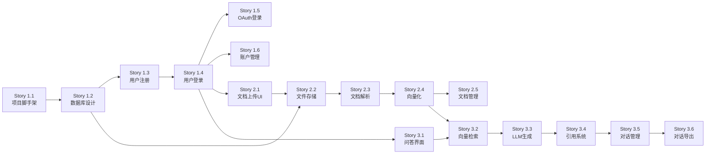

# Epic和Story索引

智能文档问答系统(DocQA System)的完整Epic和Story结构。

**项目周期**: 12周  
**总Epic数**: 4个  
**总Story数**: 33个  
**状态**: 质量改进阶段

---

## 快速导航

- [Epic 1: 基础设施与用户认证](#epic-1-基础设施与用户认证) (10 Stories, ✅ 已完成)
- [Epic 2: 文档管理与解析](#epic-2-文档管理与解析) (5 Stories, ✅ 已完成)
- [Epic 3: 智能问答与引用系统](#epic-3-智能问答与引用系统) (6 Stories, ✅ 已完成)
- [Epic 4: 系统质量改进](#epic-4-系统质量改进) (13 Stories, 🔄 进行中)

---

## Epic 1: 基础设施与用户认证

**目标**: 建立项目技术基础,实现用户认证系统

**Epic文档**: [`docs/prd/epic-1-infrastructure-auth.md`](./epic-1-infrastructure-auth.md)

**时间**: 2-3周 | **优先级**: P0 | **状态**: Ready

### 包含的Story

| Story ID | 标题 | 优先级 | 工时 | 状态 | 文档 |
|----------|------|--------|------|------|------|
| 1.1 | 项目脚手架搭建 | P0 | 2天 | Done | [Story 1.1](../stories/1.1-project-scaffolding.md) |
| 1.2 | 数据库设计与初始化 | P0 | 2天 | Done | [Story 1.2](../stories/1.2-database-design.md) |
| 1.3 | 用户注册功能 | P0 | 2天 | Done | [Story 1.3](../stories/1.3-user-registration.md) |
| 1.4 | 用户登录功能 | P0 | 2天 | Done | [Story 1.4](../stories/1.4-user-login.md) |
| 1.5 | OAuth第三方登录 | P1 | 2天 | In Progress | [Story 1.5](../stories/1.5-oauth-third-party-login.md) |
| 1.6 | 用户账户管理页面 | P1 | 3天 | Draft | [Story 1.6](../stories/1.6-user-account-management.md) |
| **1.7** | **Landing Page 与导航实现** | **P0** | **1天** | **Draft** | **[Story 1.7](../stories/1.7-landing-page.md)** |
| **1.8** | **全局 UI/UX 增强优化** | **P1** | **2-3天** | **Draft** | **[Story 1.8](../stories/1.8-ui-ux-enhancement.md)** |
| **1.9** | **测试基础设施优化** | **P2** | **0.5天** | **Done** | **[Story 1.9](../stories/1.9-testing-infrastructure.md)** |

**关键里程碑**:
- ✅ 项目基础架构完成
- ✅ 用户可以注册和登录
- ✅ 应用部署到Vercel
- ✅ 测试基础设施优化完成

**架构参考**:
- `docs/architecture.md#authentication-authorization`
- `docs/architecture.md#database-schema`

**测试文档**:
- `docs/testing/` - 测试文档中心（新增）

---

## Epic 2: 文档管理与解析

**目标**: 实现文档上传、解析、向量化,建立RAG数据基础

**Epic文档**: [`docs/prd/epic-2-document-management.md`](./epic-2-document-management.md)

**时间**: 3-4周 | **优先级**: P0 | **状态**: Ready

### 包含的Story

| Story ID | 标题 | 优先级 | 工时 | 状态 | 文档 |
|----------|------|--------|------|------|------|
| 2.1 | 文档上传UI与文件处理 | P0 | 2天 | Draft | 见story-template.md |
| 2.2 | 文件存储与元数据管理 | P0 | 2天 | Draft | 见story-template.md |
| 2.3 | PDF和Word文档解析 | P0 | 3天 | Draft | 见story-template.md |
| 2.4 | 文档分块与向量化 | P0 | 3天 | Draft | 见story-template.md |
| 2.5 | 文档列表与管理 | P0 | 3天 | Draft | 见story-template.md |

**关键里程碑**:
- ✅ 用户可以上传多种格式文档
- ✅ 文档自动解析和向量化
- ✅ 文档管理功能完整

**架构参考**:
- `docs/architecture.md#rag-implementation`
- `docs/architecture.md#document-processing-pipeline`
- `docs/architecture.md#vector-database-strategy`

**技术亮点**:
- 使用pgvector(MVP阶段),节省$70/月
- 通用向量接口设计,支持无缝迁移到Pinecone

---

## Epic 3: 智能问答与引用系统

**目标**: 实现RAG问答核心功能,交付完整MVP

**Epic文档**: [`docs/prd/epic-3-intelligent-qa.md`](./epic-3-intelligent-qa.md)

**时间**: 3-4周 | **优先级**: P0 | **状态**: Ready

### 包含的Story

| Story ID | 标题 | 优先级 | 工时 | 状态 | 文档 |
|----------|------|--------|------|------|------|
| 3.1 | 问答界面与输入处理 | P0 | 2天 | Draft | 见story-template.md |
| 3.2 | RAG向量检索实现 | P0 | 2天 | Draft | 见story-template.md |
| 3.3 | LLM回答生成与流式输出 | P0 | 3天 | Draft | 见story-template.md |
| 3.4 | 引用标注与溯源 | P0 | 3天 | Draft | 见story-template.md |
| 3.5 | 对话历史管理 | P1 | 2天 | Draft | 见story-template.md |
| 3.6 | 对话导出与分享 | P2 | 2天 | Draft | 见story-template.md |

**关键里程碑**:
- ✅ RAG问答功能可用(准确率≥85%)
- ✅ 引用系统完整(准确率≥90%)
- ✅ **MVP产品交付**

**架构参考**:
- `docs/architecture.md#rag-implementation`
- `docs/architecture.md#query-processing-pipeline`
- `docs/architecture.md#llm-universal-interface`

**技术亮点**:
- 多LLM适配器策略(智谱/OpenAI/Claude/Gemini)
- 智能路由节省~$150/月
- 流式输出优化用户体验

---

## Epic 4: 系统质量改进

**目标**: 基于QA全面评估，系统性提升安全、性能、质量和可观测性

**Epic文档**: [`docs/prd/epic-4-quality-improvements.md`](./epic-4-quality-improvements.md)

**时间**: 2周 | **优先级**: P0 | **状态**: Planning

### 包含的Story

#### Sprint 1: P0 关键改进 (Week 1)

| Story ID | 标题 | 优先级 | 工时 | 状态 | 收益 |
|----------|------|--------|------|------|------|
| 4.1 | 添加上传速率限制 | P0 | 1h | Draft | DoS 防护 |
| 4.2 | Query Embedding 缓存 | P0 | 4h | Draft | 检索快 380ms (63%⬇️) |
| 4.3 | RetrievalService 单元测试 | P0 | 8h | Draft | 回归风险降低 |
| 4.4 | AnswerService 单元测试 | P0 | 6h | Draft | 回归风险降低 |
| 4.5 | 边界情况处理增强 | P0 | 4h | Draft | 系统稳定性 |
| 4.6 | TypeScript 类型安全重构 | P0 | 16h | Draft | 类型安全 |

**Sprint 1 总工作量**: ~39小时 (~5天)

#### Sprint 2: P1 重要改进 (Week 2)

| Story ID | 标题 | 优先级 | 工时 | 状态 | 收益 |
|----------|------|--------|------|------|------|
| 4.7 | 向量维度不匹配验证 | P1 | 2h | Draft | 数据一致性 |
| 4.8 | 批处理并行优化 | P1 | 6h | Draft | 向量化快 40% |
| 4.9 | Prompt 动态调整 | P1 | 4h | Draft | 响应快 30% |
| 4.10 | E2E 集成测试 | P1 | 8h | Draft | 端到端保证 |
| 4.11 | Vercel Analytics 集成 | P1 | 2h | Draft | 性能可见性 |
| 4.12 | Axiom 日志集成 | P1 | 6h | Draft | 结构化监控 |
| 4.13 | CSP 头配置 | P1 | 2h | Draft | XSS 增强防护 |

**Sprint 2 总工作量**: ~30小时 (~4天)

### 关键里程碑

**Milestone 1: Sprint 1 完成** (Week 1 End)
- ✅ 所有 P0 Story 通过 QA 审核
- ✅ 测试覆盖率 ≥ 70%
- ✅ 查询响应时间 < 300ms
- ✅ 无 Critical 安全问题

**Milestone 2: Sprint 2 完成** (Week 2 End)
- ✅ 所有 P1 Story 通过 QA 审核
- ✅ 测试覆盖率 ≥ 80%
- ✅ 查询响应时间 < 250ms (P50)
- ✅ 监控体系完整上线

**Milestone 3: 生产部署** (Week 3)
- ✅ 完整的回归测试通过
- ✅ 性能测试验证
- ✅ 系统评分 ≥ 92/100
- ✅ 生产就绪度 ≥ 95%

### 成功指标

| 指标 | 基线 | 目标 | 提升 |
|-----|------|------|------|
| 系统评分 | 85/100 | ≥92/100 | +7分 |
| 查询响应 (P50) | 600ms | ≤250ms | 58%⬇️ |
| 测试覆盖率 | 65% | ≥80% | +15% |
| TypeScript any | 24处 | 0处 | 100%⬇️ |
| 生产就绪度 | 82% | ≥95% | +13% |

**架构参考**:
- `docs/qa/system-comprehensive-quality-assessment.md` - 质量评估报告
- `docs/testing/strategy.md` - 测试策略
- `docs/architecture.md` - 架构文档

**技术亮点**:
- Query Embedding 缓存: 检索速度提升 63%
- 批处理并行: 向量化速度提升 40%
- 完整监控体系: Vercel Analytics + Axiom

---

## 开发时间线

### MVP 阶段 (已完成)
```
Week 1-2:   Epic 1 基础设施 (Story 1.1-1.3) ✅
Week 3:     Epic 1 认证系统 (Story 1.4-1.6) ✅
Week 4-5:   Epic 2 文档上传和存储 (Story 2.1-2.2) ✅
Week 6-7:   Epic 2 文档解析和向量化 (Story 2.3-2.5) ✅
Week 8:     Epic 3 RAG核心实现 (Story 3.1-3.3) ✅
Week 9:     Epic 3 引用和对话管理 (Story 3.4-3.6) ✅
Week 10:    集成测试、优化、MVP交付 ✅
```

### 质量改进阶段 (当前)
```
Week 11:    Epic 4 Sprint 1 - P0 关键改进 (Story 4.1-4.6) 🔄
Week 12:    Epic 4 Sprint 2 - P1 重要改进 (Story 4.7-4.13) 📋
Week 13:    回归测试、性能验证、生产部署 📋
```

---

## Story状态说明

| 状态 | 说明 |
|------|------|
| **Draft** | 已规划,待开发 |
| **In Progress** | 开发中 |
| **Review** | 代码审查中 |
| **Testing** | 测试中 |
| **Done** | 已完成 |

---

## 优先级说明

| 优先级 | 说明 |
|--------|------|
| **P0** | MVP必须功能,阻塞其他Story |
| **P1** | MVP重要功能,增强用户体验 |
| **P2** | MVP可选功能,可以后续版本实现 |

---

## 依赖关系



---

## 相关文档

### 核心文档
- [PRD](../prd.md) - 产品需求文档
- [Architecture](../architecture.md) - 技术架构文档
- [Front-End Spec](../front-end-spec.md) - 前端UI规范

### Epic文档
- [Epic 1: 基础设施与用户认证](./epic-1-infrastructure-auth.md)
- [Epic 2: 文档管理与解析](./epic-2-document-management.md)
- [Epic 3: 智能问答与引用系统](./epic-3-intelligent-qa.md)
- [Epic 4: 系统质量改进](./epic-4-quality-improvements.md)

### 质量文档
- [全面质量评估报告](../qa/system-comprehensive-quality-assessment.md)

### Story文档
- 详细Story文档: `docs/stories/`
- Story模板参考: `docs/stories/story-template.md`
- **UI系统集成指南（Epic 2/3必读）**: `docs/stories/ui-system-integration-guide.md`

---

## 开发规范

### 通用规范

每个Story开发必须包含:
1. ✅ **功能实现**: 满足所有验收标准
2. ✅ **单元测试**: 核心逻辑覆盖率≥70%
3. ✅ **集成测试**: API端到端测试
4. ✅ **代码审查**: 至少1人review
5. ✅ **文档更新**: 更新相关技术文档

### UI系统规范（2025-01-03新增）

**适用于 Epic 2、Epic 3 及所有后续开发**：

6. ✅ **主题系统合规**: 所有颜色使用语义化类名，禁止硬编码
7. ✅ **暗色模式测试**: 在亮色和暗色模式下均测试通过
8. ✅ **性能约束**: 遵循 Story 1.8 的性能要求（动画≥60fps，打包<50KB增量）
9. ✅ **可访问性**: 颜色对比度≥4.5:1，支持键盘导航
10. ✅ **代码检查**: 运行 `grep -r "bg-blue-\|text-gray-" src/` 无硬编码颜色

**详细规范**: 参见 `docs/stories/ui-system-integration-guide.md`

---

## 成功指标

### MVP 交付标准 (✅ 已达成)
- ✅ 所有P0 Story完成(19个)
- ✅ 问答准确率≥85%
- ✅ 引用准确率≥90%
- ✅ 性能指标达标(首屏<2s, 问答<8s)
- ✅ 测试覆盖率 65%
- ✅ 部署到生产环境

### 质量改进目标 (Epic 4)
- 🎯 系统评分从 85 → 92+
- 🎯 查询响应从 600ms → 250ms
- 🎯 测试覆盖率从 65% → 80%
- 🎯 TypeScript 类型安全 (0 warnings)
- 🎯 生产就绪度从 82% → 95%

### 用户指标 (持续监控)
- 注册转化率>80%
- 文档上传成功率>98%
- 7日留存率>40%
- 查询满意度>85%

---

**文档版本**: 2.0  
**创建日期**: 2025-01-03  
**最后更新**: 2025-01-10  
**负责人**: Sarah (Product Owner)

