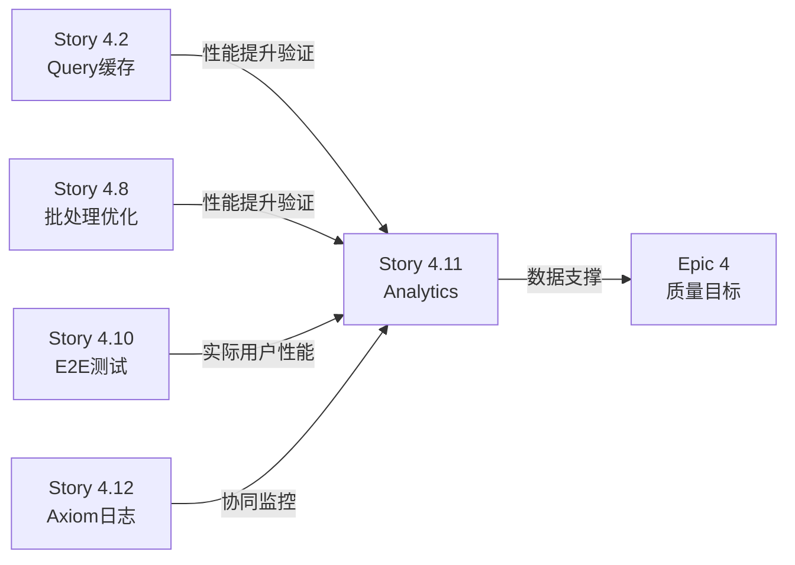

# Story 4.11: Vercel Analytics 集成

**Story ID**: 4.11  
**Epic**: 4 - 系统质量改进  
**优先级**: P1 (Important - 可观测性建设)  
**预估工时**: 2小时  
**状态**: Deferred (无 Vercel Pro 计划)

---

## User Story

作为**系统运维团队**,  
我想要**集成 Vercel Analytics 进行实时性能监控**,  
以便**跟踪 Web Vitals 指标、用户访问数据和性能瓶颈，为系统优化提供数据支撑**。

---

## ⚠️ Story 状态: 延期

**决策日期**: 2025-01-15  
**决策人**: Sarah (Product Owner)  
**原因**: 当前项目没有 Vercel Pro 计划 (需要 $20/月)

**影响**:
- ✅ Epic 4 核心目标不受影响
- ✅ 性能验证使用替代方案 (Lighthouse + 手动测试)
- ✅ Sprint 2 工作量从 30h → 28h,缓冲更充足

**后续计划**:
- 保留在 Backlog,优先级降为 P2
- Phase 2 考虑升级 Vercel Pro 或使用 Google Analytics 4
- 详见 `docs/prd/epic-4-quality-improvements.md` Scope 变更记录

---

## Story Context

### 背景 (原始需求 - 供参考)

**当前监控状态**:

从架构文档 (`docs/architecture.md` 第 183-196 行) 可以看到:

1. **已计划的监控体系**:
   ```yaml
   性能监控: Vercel Analytics - 包含在Vercel Pro ($20/月)
   错误追踪: Sentry - Free ($0, 5K事件/月)
   应用日志: Axiom - Free ($0, 500GB/月)
   ```

2. **当前状态**: ❌ **Vercel Analytics 尚未集成**
   - 无法实时查看性能指标
   - 缺少 Web Vitals 数据 (LCP, FID, CLS)
   - 无法追踪用户访问模式
   - 性能优化缺少数据依据

3. **Epic 4 质量改进的监控需求**:
   - Story 4.2 完成后,需要验证查询响应时间优化效果 (从 600ms → <250ms)
   - Story 4.8 批处理优化需要性能数据验证
   - 整个 Epic 4 的性能目标需要量化监控

**为什么需要 Vercel Analytics**:

| 维度 | 当前状态 | Vercel Analytics 提供 | 业务价值 |
|-----|---------|---------------------|---------|
| **性能监控** | 无数据 | Web Vitals 实时监控 | 优化用户体验 |
| **响应时间** | 主观感受 | 精确 P50/P95/P99 数据 | 量化性能目标 |
| **访问统计** | 无 | 页面 PV/UV、访问来源 | 了解用户行为 |
| **错误率** | 仅 Sentry 错误事件 | 性能错误关联 | 全面故障定位 |
| **设备分布** | 未知 | 设备/浏览器/地域 | 优化兼容性 |

**与其他 Epic 4 Story 的关联**:



---

## Acceptance Criteria

1. ✅ **依赖安装**:
   - 安装 `@vercel/analytics` 包
   - 版本: 最新稳定版 (^1.x)

2. ✅ **集成配置**:
   - 在根布局 `src/app/layout.tsx` 中集成 Analytics 组件
   - 仅在生产环境启用 (`process.env.NODE_ENV === 'production'`)
   - 不影响开发环境性能

3. ✅ **数据上报验证**:
   - 部署到 Vercel 后,验证 Analytics Dashboard 能看到数据
   - 验证 Web Vitals 数据正常上报 (LCP, FID, CLS, TTFB, INP)
   - 验证页面访问数据正常记录

4. ✅ **性能影响评估**:
   - Analytics 集成后,首屏加载时间增加 <50ms
   - 不影响 Lighthouse Performance 评分 (保持 ≥90)
   - 异步加载,不阻塞页面渲染

5. ✅ **文档更新**:
   - 更新部署文档,说明 Analytics 配置
   - 添加 Dashboard 访问方式和关键指标解读

---

## Tasks / Subtasks

### Task 1: 安装 Vercel Analytics 依赖 (AC: 1)
- [ ] 安装 `@vercel/analytics` 包
  ```bash
  npm install @vercel/analytics
  ```
- [ ] 验证 `package.json` 中依赖版本正确
- [ ] 确认 TypeScript 类型定义可用

### Task 2: 集成 Analytics 到根布局 (AC: 2)
- [ ] 导入 Analytics 组件到 `src/app/layout.tsx`
- [ ] 添加 `<Analytics />` 组件到布局 JSX
- [ ] 配置仅生产环境启用
- [ ] 保持现有布局结构不变

### Task 3: 验证数据上报 (AC: 3)
- [ ] 本地测试:生产构建并验证脚本加载
  ```bash
  npm run build
  npm start
  ```
- [ ] 部署到 Vercel Dev 环境
- [ ] 访问 Vercel Dashboard → Analytics 页面
- [ ] 验证以下数据正常:
  - Web Vitals 指标出现
  - 页面访问记录 (至少 3 个页面)
  - 设备和浏览器信息
- [ ] 等待 5-10 分钟让数据聚合显示

### Task 4: 性能影响测试 (AC: 4)
- [ ] 使用 Lighthouse 测试集成前后的性能
- [ ] 对比首屏加载时间 (before vs after)
- [ ] 验证 Performance Score 保持 ≥90
- [ ] 检查 Network 面板,确认 Analytics 脚本异步加载

### Task 5: 文档更新 (AC: 5)
- [ ] 更新 `docs/deployment/3-vercel-deployment.md`:
  - 添加 "Vercel Analytics 配置" 章节
  - 说明如何访问 Dashboard
  - 列出关键监控指标
- [ ] 添加性能基线数据到文档
- [ ] 更新 `README.md` 添加监控体系说明

---

## Dev Notes

### 项目布局结构

**根布局文件**: `src/app/layout.tsx`

[Source: `src/app/layout.tsx` 代码审查]

当前布局结构:
```typescript
import type { Metadata } from 'next'
import { Inter } from 'next/font/google'
import './globals.css'
import { SessionProvider } from '@/components/providers/SessionProvider'
import { ThemeProvider } from '@/components/providers/ThemeProvider'
import { Toaster } from '@/components/ui/toaster'

export default function RootLayout({ children }) {
  return (
    <html lang="zh-CN" suppressHydrationWarning>
      <body className={inter.className}>
        <ThemeProvider>
          <SessionProvider>
            {children}
          </SessionProvider>
          <Toaster />
        </ThemeProvider>
      </body>
    </html>
  )
}
```

**集成位置**: 在 `<body>` 内部,但在闭合标签前添加 `<Analytics />` 组件。

---

### Vercel Analytics 技术细节

[Source: Vercel 官方文档 + `docs/architecture.md` 第 189 行]

**1. 集成方式**:
```typescript
import { Analytics } from '@vercel/analytics/react'

export default function RootLayout({ children }) {
  return (
    <html>
      <body>
        {children}
        <Analytics />
      </body>
    </html>
  )
}
```

**2. 生产环境条件判断**:
```typescript
{process.env.NODE_ENV === 'production' && <Analytics />}
```

**3. 数据收集内容**:
- **Web Vitals**:
  - LCP (Largest Contentful Paint) - 最大内容绘制
  - FID (First Input Delay) - 首次输入延迟
  - CLS (Cumulative Layout Shift) - 累积布局偏移
  - TTFB (Time to First Byte) - 首字节时间
  - INP (Interaction to Next Paint) - 交互到下次绘制
- **页面数据**:
  - 页面访问量 (PV)
  - 独立访客 (UV)
  - 访问来源 (Referrer)
  - 设备类型 (Desktop/Mobile/Tablet)
  - 浏览器和操作系统
  - 地理位置 (国家/地区)

**4. 性能影响**:
- 脚本大小: ~1.5KB (gzipped)
- 异步加载,不阻塞渲染
- 使用 `requestIdleCallback` 在空闲时上报

---

### 验证步骤

**本地验证**:
1. 生产构建:
   ```bash
   npm run build
   npm start
   ```
2. 打开浏览器 DevTools → Network
3. 筛选 "analytics" 请求
4. 确认看到数据上报请求 (va.vercel-scripts.com)

**Vercel Dashboard 验证**:
1. 登录 Vercel Dashboard
2. 选择项目 → Analytics 标签
3. 验证数据显示:
   - **Real-time**: 实时访问数
   - **Web Vitals**: 各指标分布
   - **Top Pages**: 页面访问排名
   - **Devices**: 设备分布

---

### 相关 Epic 4 Story 的性能基线

[Source: `docs/prd/epic-4-quality-improvements.md` 和相关 Story 的完成数据]

**Story 4.2 Query Embedding 缓存**:
- 目标: 查询响应时间从 ~600ms → <250ms
- Analytics 将追踪: `/api/chat/query` 端点响应时间

**Story 4.8 批处理并行优化**:
- 目标: 文档处理速度提升 40%
- Analytics 将追踪: 文档上传到就绪的端到端时间

**整体 Epic 4 目标**:
- 系统评分: 85/100 → ≥92/100
- 查询响应 P50: <250ms
- 查询响应 P95: <400ms

---

### 环境要求

**必需**:
- Vercel 账号 (已有)
- 项目部署在 Vercel 平台
- Vercel Pro 计划 (已包含 Analytics,无需额外配置)

**不需要**:
- ❌ 无需配置环境变量
- ❌ 无需 Analytics ID
- ❌ 无需修改 `vercel.json`

**原因**: Vercel Analytics 自动关联项目,无需手动配置。

---

### 故障排查

**如果 Dashboard 无数据**:

1. **检查环境**:
   ```typescript
   console.log('NODE_ENV:', process.env.NODE_ENV)
   ```
   - 确认生产环境为 'production'

2. **检查脚本加载**:
   - DevTools → Network → 搜索 "analytics"
   - 应该看到 `/_vercel/insights/script.js`

3. **检查浏览器控制台**:
   - 无错误日志
   - 可能看到 "Vercel Analytics initialized" (调试模式)

4. **等待数据聚合**:
   - 数据可能延迟 5-15 分钟显示
   - 实时数据需要有真实流量

---

## Testing

### 测试策略

[Source: `docs/testing/strategy.md`]

**本 Story 测试特点**:
- 主要是**手动集成验证**
- 无需单元测试 (SDK 已测试)
- 性能测试验证影响

---

### 测试文件位置

**不需要新建测试文件**

原因:
1. Vercel Analytics 是第三方 SDK,已有完善测试
2. 集成代码极简 (`<Analytics />` 组件)
3. 验证方式主要是观察 Dashboard 数据

---

### 验证检查清单

**集成验证**:
- [ ] 生产构建成功
- [ ] 本地生产模式能看到 Analytics 脚本加载
- [ ] Vercel 部署后 Dashboard 有数据

**性能验证**:
- [ ] Lighthouse Performance Score ≥90
- [ ] 首屏加载时间增加 <50ms
- [ ] Analytics 脚本异步加载,不阻塞

**数据验证**:
- [ ] Web Vitals 数据正常
- [ ] 页面访问数据正常
- [ ] 设备和浏览器信息正确

---

### 测试框架和工具

[Source: `docs/testing/strategy.md`, `package.json`]

**性能测试工具**:
- Lighthouse (Chrome DevTools)
- Vercel Analytics Dashboard
- Chrome DevTools Performance 面板

**测试命令**:
```bash
# 生产构建测试
npm run build
npm start

# 访问本地 http://localhost:3000
# 使用 Lighthouse 进行性能测试
```

---

## Change Log

| Date | Version | Description | Author |
|------|---------|-------------|--------|
| 2025-01-15 | 1.0 | 创建 Story 4.11: Vercel Analytics 集成 | Bob (Scrum Master) |

---

## Dev Agent Record

### Agent Model Used

_待 Dev Agent 填写_

---

### Debug Log References

_待 Dev Agent 在实施过程中填写_

---

### Completion Notes List

_待 Dev Agent 完成任务后填写_

---

### File List

_待 Dev Agent 记录所有修改的文件_

**预期修改文件**:
- `package.json` (新增依赖)
- `package-lock.json` (依赖锁定)
- `src/app/layout.tsx` (集成 Analytics)
- `docs/deployment/3-vercel-deployment.md` (文档更新)
- `README.md` (可选,监控体系说明)

---

## QA Results

_待 QA Agent (Quinn) 审核后填写_

